# iOS逆向实战(微信自动抢红包上)


今天开始介绍如何一步步逆向微信app，写一个自动抢红包插件。我们最终成品是写一个能自动抢红包并且在非越狱手机上安装的多开微信。

我暂时打算分3篇文章介绍整个逆向开发过程。逆向的是目前为止微信最新版本6.6.1。我们能做到的是微信APP在前台任何页面有红包消息到来时，实现自动抢红包。

### 前提

#####1. 一台越狱iPhone手机，最好是iPhone5s及以上型号手机，因为从iPhone5s后全是arm64处理器。

##### 2. 逆向工具集

- 检测工具
  如：Reveal、tcpdump等

- 反编译工具（反汇编工具 - 分析二进制文件并得到一些信息）
  如：IDA、Hopper Disassembler、classdump等

- 调试工具
  如：lldb、Cycript等

- 开发工具
  如：Xcode、theos等

- 打包工具

  如：iTools、iOS App Signer等

- 辅助工具

  如：OPENSSH、vim、ps、network-cmds等

#####3. 基本的逆向知识和工具使用技能

##### 4. 一颗戒骄戒躁、勇于尝试的心

关于逆向开发和工具集的介绍、使用我在原来的文章中已经介绍过，我们在这里不再介绍直接使用。有疑惑或者兴趣的童鞋可以关注我微信公众号：`乐Coding`查看。


### 砸壳导出头文件

砸壳把微信的Mach-O文件拷贝到电脑，然后用classdump导出头文件留作备用。这两步我在[逆向第一课](https://www.jianshu.com/p/4306155906dc)中已经介绍过不在赘述。如果觉得自己砸壳还得拷贝到电脑麻烦，可以从`PP助手`上下载相同版本的越狱包。

### 查找收红包方法

我们要实现在任何页面都能自动抢红包，首先我们要找到收红包的接口，然后再实现拆红包和抢红包。

如何找到收红包的接口呢，我们要从聊天页面开始。看看当红包消息到来时，哪些方法会被调用。

#### 一、定位聊天控制器

在越狱手机上打开微信，点击进入单聊或者群聊页面。

##### 1. 打开Mac终端，ssh连接到手机

这里的`192.168.220.195`是我越狱手机的`IP`地址，你操作时要换成自己手机的`IP`地址

```shell
ssh root@192.168.220.195
```

#####2. 查看微信进程ID 

```shell
ps -e | grep WeChat
```

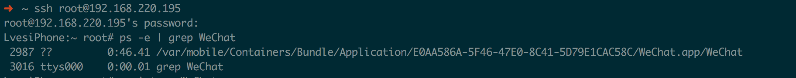

##### 3. 使用cycript附加进程

```
cycript -p WeChat
```

##### 4. 找到当前的控制器

找到当前的聊天控制器名字可以使用Reveal一眼看到，也可以使用下面我介绍的第二种方法。

***4.1*** 打印UIView对象

```
UIApp.keyWindow.recursiveDescription().toString()
```

打印结果如下：


***4.2*** 选择任意一个控件，用控件地址调用`nextResponder`方法，找到控制器。

如果一步不是，就递归调用，直到nextResponder是ViewController为止。

我们以上图中的蓝色标注ImageView为例查找。

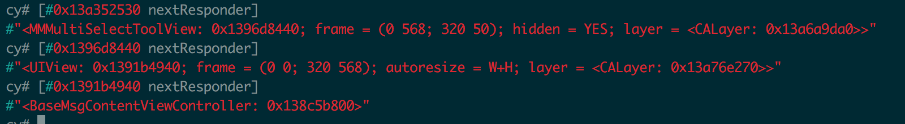

所以聊天的控制器就是`BaseMsgContentViewController`。查看我们导出的头文件也能找到同名的`BaseMsgContentViewController.h`文件。


#### 二、 创建Tweak项目

我们已经找到了聊天页面的控制器名，并且发现有同名的头文件。下面我们先来创建一个Tweak项目用于以后的调试。

在Mac上创建微信的Tweak项目，不清楚的请移步[逆向第二课](https://www.jianshu.com/p/4a1953f613d1)。

创建命令和最终项目目录如下图：

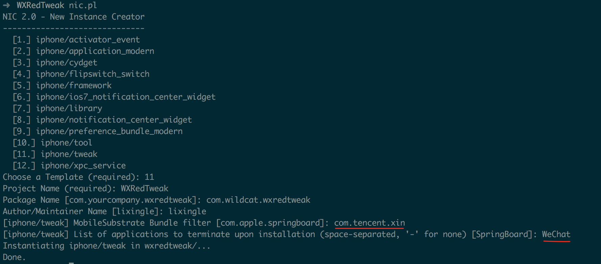

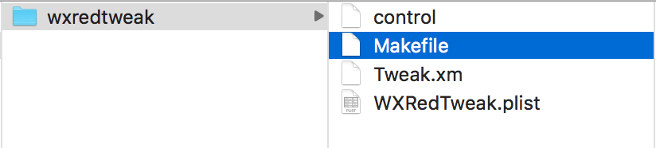

创建成功后，Makefile初始内容：

```shell
include $(THEOS)/makefiles/common.mk
TWEAK_NAME = WXRedTweak
WXRedTweak_FILES = Tweak.xm
include $(THEOS_MAKE_PATH)/tweak.mk
after-install::
	install.exec "killall -9 WeChat"
```

添加一些便于测试的配置,修改后如下：

```shell
ARCHS = armv7 arm64				     #支持cpu类型
TARGET = iphone:latest:8.0		     #最低支持版本
THEOS_DEVICE_IP = 192.168.220.195    #手机的ip
include $(THEOS)/makefiles/common.mk

TWEAK_NAME = WXRedTweak
WXRedTweak_FILES = Tweak.xm
WXRedTweak_FRAMEWORKS = UIKit		#需要的框架

include $(THEOS_MAKE_PATH)/tweak.mk

clean::
	rm -rf ./packages/* 

after-install::
	install.exec "killall -9 WeChat"
```


####三、查找BaseMsgContentViewController中接收消息的方法

#####1. 使用logify.pl给BaseMsgContentViewController所有函数添加log

```shell
/opt/theos/bin/logify.pl /Users/lixingle/Desktop/test/result/Headers/BaseMsgContentViewController.h > /Users/lixingle/Desktop/test/result/Tweak/WXRedTweak/wxredtweak/Tweak.xm
```

执行完以上命令，查看Tweak.xm文件就会发现已经给`BaseMsgContentViewController`的所有方法添加上了log

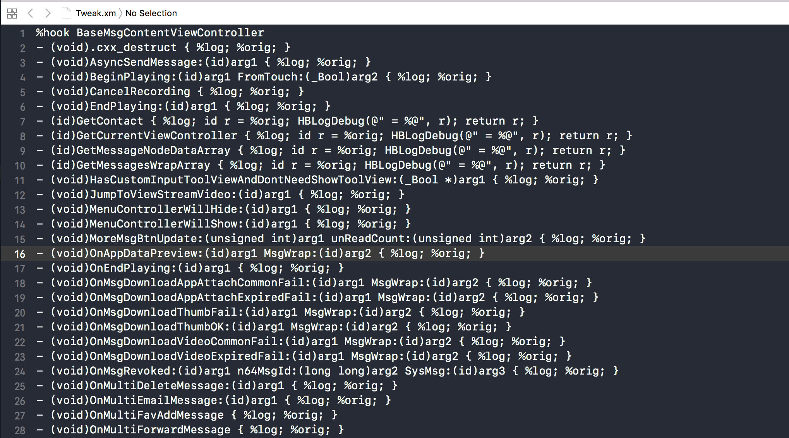


**1.1 **删除影响编译的函数

Tweak项目执行make命令，发现那个函数影响编译先删除。

最终删除的函数有

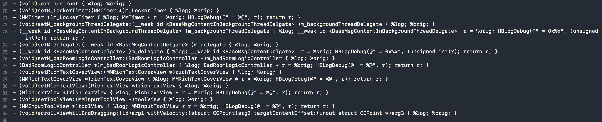

**1.2 ** 编译安装到越狱手机：

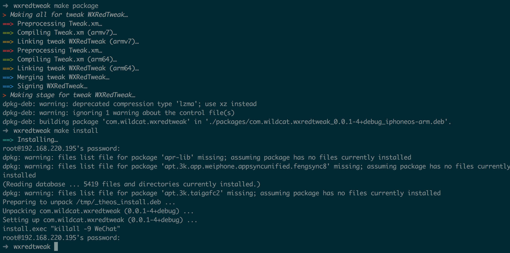

**1.3** 在越狱手机上查看log

这里需要另一个手机给这台越狱手机发红包，有女票的可以用女票的手机，没有的用别人女票的，像我这样都没有的只能注册两个微信号了。

- 在越狱手机终端执行查看log命令`tail -f /var/log/syslog | grep WeChat`
- 用另一个手机给这台越狱手机发送一个红包或者文本消息，
- 多次尝试上一步，查看log有没有规律

经过多次分析 — 删除无用函数 — 编译安装 — 再分析的过程，最后只剩下几个和`message`相关的函数

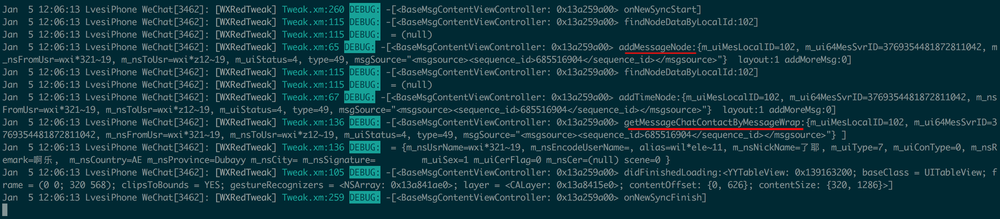

根据常识定位到与消息响应相关的方法：

```objective-c
-(void)addMessageNode:(id)arg1 layout:(_Bool)arg2 addMoreMsg:(_Bool)arg3 { %log; %orig; }
```

#### 四、 查找全局接收消息的方法

我们知道了聊天页面响应消息的方法，下面就需要分析这个方法的调用堆栈，找到那个最顶层接收消息的方法。猜测可能是通知、代理、监听或者管理中心之类机制会在消息到来时告知聊天控制器。那我们应该怎么分析呢？答案就是通过`lldb`动态调试。

##### 1. lldb 调试准备

**1.1** 在越狱手机终端中输入

`debugserver *:9527 -a "WeChat"`

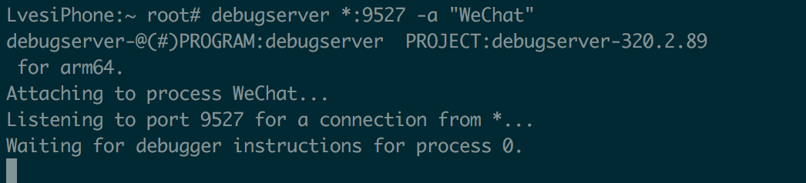

**1.2** 重新打开一个Mac终端，进入`lldb`后执行

`process connect connect://192.168.220.195:9527`

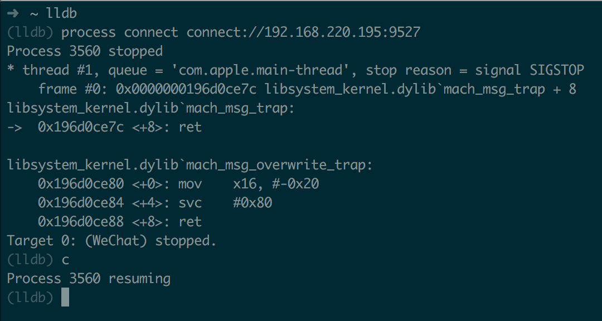

#####2. 分析`addMessageNode`函数调用堆栈

给`-(void)addMessageNode:(id)arg1 layout:(_Bool)arg2 addMoreMsg:(_Bool)arg3`方法添加断点，首先要找到该方法的内存地址也就是该函数偏移后的基地址。

偏移后的基地址=偏移前基地址+指令所在模块的ASLR偏移

**2.1 ** 查找ASLR偏移地址

在lldb中输入`image list -o -f`命令，执行结果如下，第一个就是ASLR地址：0x94000

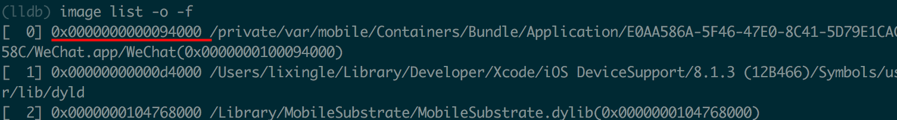

**2.2** 查看偏移前函数基地址

打开`IDA`或者`Hopper`，搜索`addMessageNode`,就可以找到。我用的是IDA反汇编微信的`Mach-O`文件。下图中标红的位置就是该函数偏移前的基地址：`0x0000000101FA957C`

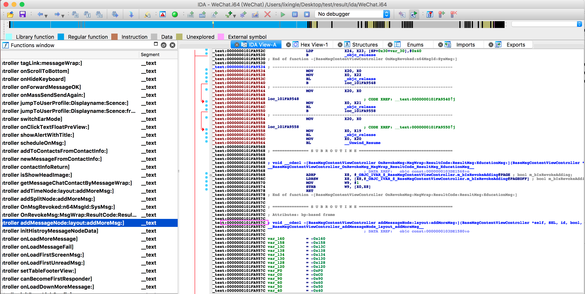

所以`addMessageNode`的内存偏移后地址 = 0x101FA957C + 0x94000 = 0x10203D57C

**2.3** 添加断点

lldb中在`0x10203D57C`处添加断点` br s -a 0x10203D57C`,添加成功后，给微信发送一条信息看能不能进断点。

发送一条消息果然进断点了，这时执行`bt`命令查看调用堆栈如下：

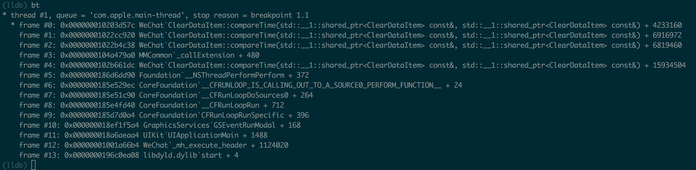

**2.4** 依次把上图中的fame#0 - frame4对应地址翻译成函数名

偏移前基地址 = 偏移后地址 - ASLR偏移地址

frame #0 = 0x000000010203d57c - 0x94000 = 0x101FA957C

frame #1 = 0x00000001022cc920 - 0x94000 = 0x102238920

frame #2 = 0x00000001022b4c38 - 0x94000 = 0x102220C38

frame #3 = 0x0000000104a479a0 - 0x94000 = 0x1049B39A0

frame #4 = 0x0000000102b661dc - 0x94000 = 0x102AD21DC

在lldb中依次查看偏移前基地址对应函数名

0x101FA957C：[BaseMsgContentViewController addMessageNode:layout:addMoreMsg:]

0x102238920：[BaseMsgContentLogicController DidAddMsg:]

0x102220C38：[BaseMsgContentLogicController OnAddMsg:MsgWrap:]

0x1049B39A0：MMCommon`_callExtension + 480 //扩展函数，排除

0x102AD21DC：[CMessageMgr MainThreadNotifyToExt:]

**2.5** 继续查找堆栈中函数

依次在frame0 、1、2、3 、5处添加断点，查看当退出聊天室在其他页面时能否进断点。

经过测试，只有frmae #5: 0x0000000102b661dc处设置的断点，无论在微信任何页面收到红包都能触发断点。

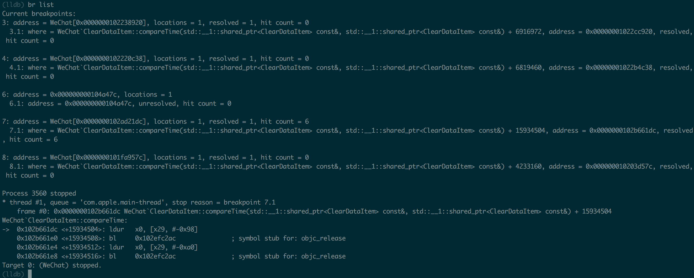

`0x0000000102b661dc`对应的方法名我们已经在上一步分析到是：`[CMessageMgr MainThreadNotifyToExt:]`，到此我们初步分析到一个收到消息会调用的全局函数`[CMessageMgr MainThreadNotifyToExt:]`。


#### 五、 分析CMessageMgr类

接下来我们需要分析`CMessageMgr`看这个名字像是一个消息管理中心,可能离我们要找的全局接收消息的函数不远了。

##### 1.  logify分析CMessageMgr

按照第三部`logify.pl`添加`log`的方式分析`CMessageMgr`类。这里我们不在赘述具体步骤。

经过分析`log`，消息到来时按照先后顺序会依次调用一下10个函数，当然并不是每一个都是接收消息方法。

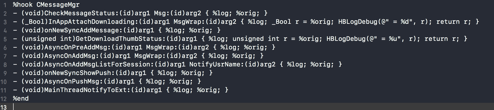

根据函数名和程序员第七感我们着重分析以下四个函数：

```objective-c
- (void)CheckMessageStatus:(id)arg1 Msg:(id)arg2 { %log; %orig; }
- (void)AsyncOnPreAddMsg:(id)arg1 MsgWrap:(id)arg2 { %log; %orig; }
- (void)AsyncOnAddMsg:(id)arg1 MsgWrap:(id)arg2 { %log; %orig; }
- (void)AsyncOnPushMsg:(id)arg1 { %log; %orig; }
```

**1.1**  当每次进聊天室时都会调用`CheckMessageStatus`,所以排除它。

**1.2**  AsyncOnPreAddMsg、AsyncOnAddMsg、AsyncOnPushMsg这三个方法都是在消息到来时触发，从
  方法命名AsyncOnPreAddMsg应该是消息的前置处理，AsyncOnPushMsg可能是往队列里面添加消息。
  这三个方法都可以用来备选，我们先选AsyncOnAddMsg。

#####2. 分析AsyncOnAddMsg

```objective-c
%hook CMessageMgr
- (void)AsyncOnAddMsg:(id)arg1 MsgWrap:(id)arg2 {
    NSLog(@"arg1 = %@ , arg2 = %@", arg1, arg2);
    NSLog(@"arg1 class = %@ , arg2 class = %@", [arg1 class], [arg2 class]);
    %orig;
}
%end
```

log输出如下：

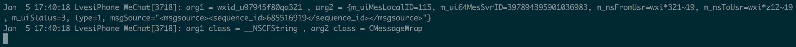

arg1:NSString

arg2: CMessageWrap

我们也能在头文件中找到CMessageWrap同名的头文件,所以函数声明如下：

```objective-c
- (void)AsyncOnAddMsg:(NSString *)wxid MsgWrap:(CMessageWrap *)wrap;
```

##### 3. 分析CMessageWrap消息内容相关的类

经过分析CMessageWrap头文件和查看不同消息类型的log输出，Tweak最终修改如下：

```objective-c
@interface CMessageWrap
@property (nonatomic, strong) NSString* m_nsContent;
@property (nonatomic, assign) NSInteger m_uiMessageType;
@property(retain, nonatomic) NSString *m_nsFromUsr;
@property(retain, nonatomic) NSString *m_nsToUsr;
@property(retain, nonatomic) NSString *m_nsAtUserList;
@property(retain, nonatomic) NSString *m_nsBizChatId;
@property(retain, nonatomic) NSString *m_nsBizClientMsgID;
@property(retain, nonatomic) NSString *m_nsDisplayName;
@property(retain, nonatomic) NSString *m_nsKFWorkerOpenID;
@property(retain, nonatomic) NSString *m_nsMsgSource;
@property(retain, nonatomic) NSString *m_nsPattern;
@property(retain, nonatomic) NSString *m_nsPushContent;
@property(retain, nonatomic) NSString *m_nsRealChatUsr;
@end

%hook CMessageMgr
- (void)AsyncOnAddMsg:(NSString *)wxid MsgWrap:(CMessageWrap *)wrap {
    %orig;
    NSInteger uiMessageType = [wrap m_uiMessageType];
    NSString* content = [wrap m_nsContent];
    NSString* nsFromUsr = [wrap m_nsFromUsr];
    NSString* nsToUsr = [wrap m_nsToUsr];
    NSString* nsAtUserList = [wrap m_nsAtUserList];
    NSString* nsBizChatId = [wrap m_nsBizChatId];
    NSString* nsBizClientMsgID = [wrap m_nsBizClientMsgID];
    NSString* nsKFWorkerOpenID = [wrap m_nsKFWorkerOpenID];
    NSString* nsMsgSource = [wrap m_nsMsgSource];
    NSString* nsDisplayName = [wrap m_nsDisplayName];
    NSString* nsPattern = [wrap m_nsPattern];
    NSString* nsRealChatUsr = [wrap m_nsRealChatUsr];
    NSString* nsPushContent = [wrap m_nsPushContent];

    NSLog(@"m_uiMessageType=%zd m_nsContent=%@ m_nsFromUsr=%@ m_nsToUsr=%@ m_nsAtUserList=%@ m_nsBizChatId=%@ m_nsBizClientMsgID=%@ m_nsDisplayName=%@ m_nsKFWorkerOpenID=%@ m_nsMsgSource=%@ m_nsPattern=%@ m_nsPushContent=%@ m_nsRealChatUsr=%@",
        uiMessageType,
        content,
        nsFromUsr,
        nsToUsr,
        nsAtUserList,
        nsBizChatId,
        nsBizClientMsgID,
        nsDisplayName,
        nsKFWorkerOpenID,
        nsMsgSource,
        nsPattern,
        nsPushContent,
        nsRealChatUsr);
    //记录消息
    if( 1 == uiMessageType ){ //普通消息
        if( 0 == nsPushContent.length){
            if([nsToUsr rangeOfString:@"filehelper"].location != NSNotFound){
                NSLog(@"[文件助手: %@]",content);
            }else {
                NSLog(@"[我: %@]",content);
            }
        }else{
            NSLog(@"[%@]",nsPushContent);
        }
    }else if ( 3 == uiMessageType ){ //图片消息
        NSLog(@"收到图片消息");
    }else if ( 49 == uiMessageType ){ //红包消息
        NSLog(@"收到红包消息");
    }
}
%end
```

至此我们已经找到了微信中全局接收消息的方法和红包的类型类型`uiMessageType = 49`。接下来我们只需要找到抢红包的方法，然后当红包消息到来时自动调用抢红包方法就可以了。

### 何去何从

万里长征我们迈出了第一步，更难的还在后边。接下来我会用2篇文章讲解怎么反汇编找到抢红包的函数，怎么在设置页面添加一个自动抢红包的开关以及微信的多开。[iOS逆向实战(微信自动抢红包中)](https://github.com/Lves/WXRedTweak/blob/master/Articles/%E5%BE%AE%E4%BF%A1%E6%8A%A2%E7%BA%A2%E5%8C%85%E4%B8%AD.md)


