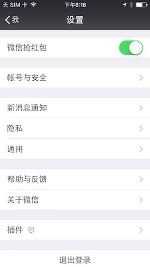

## 微信自动抢红包下

[TOC]

在前两篇文章中，我们详细介绍了如何反汇编、创建Tweak项目实现自动抢红包功能的思路。今天我们继续下篇，主要说两个事：添加一个开关控制自动抢红包，打包冲签名安装到非越狱手机上。

### 添加抢红包开关

我们先来讲解怎么在设置页面添加一个开关控制自动抢红包。

效果如下图：




#### 查找设置页Controller

可以通过`cycript`附加微信进程或者`Reveal`工具的方式查找当前Controller的名字（不会的可以看前两篇文章），很容易可以找到设置页面Controller是：`NewSettingViewController`

#### 添加UISwitch开关

下面要考虑，怎么在UITableView中添加一个cell呢？

在导出的头文件中可以找到`NewSettingViewController`同名的头文件`NewSettingViewController.h`,分析头文件可以看到有一个` MMTableViewInfo *m_tableViewInfo;`，猜测它可能含有TableView的信息。

**分析MMTableViewInfo**

查看MMTableViewInfo同名的头文件，里边有一个` MMTableView *_tableView;`成员变量，并且MMTableViewInfo实现了UITableView的`UITableViewDelegate, UITableViewDataSource`两个协议。所以可以肯定MMTableViewInfo控制TableView的数据源和代理事件。

仔细观察MMTableViewInfo头文件，还有两个方法

```objective-c
- (void)addSection:(id)arg1;
- (void)insertSection:(id)arg1 At:(unsigned int)arg2;
```

这可能正是为TableView添加一个Section。

使用logify.pl可以查看`insertSection: At:`第一个参数是什么类型

```objective-c
%hook MMTableViewInfo
- (void)insertSection:(id)arg1 At:(unsigned int)arg2 {
    NSLog(@"insertSection arg1:%@",[arg1 class]);
    %log;
    %orig;
}
- (void)addSection:(id)arg1 {
    NSLog(@"addSection arg1:%@",[arg1 class]);
    %log;
    %orig;
}
%end
```

经验证，以上方法的arg1类型是：MMTableViewSectionInfo，查看MMTableViewSectionInfo同名的头文件，可以看到我们想要的另外两个方法：

```objective-c
- (void)addCell:(id)arg1;
- (void)insertCell:(id)arg1 At:(unsigned int)arg2;
```

相同的方式可以确定以上两个方法的arg1类型：`MMTableViewCellInfo`。接下来就需要查找MMTableViewCellInfo同名的头文件`MMTableViewCellInfo.h`怎么创建一个CellInfo。

经查找，发现三个我们用得到的方法

```objective-c
+ (id)switchCellForSel:(SEL)arg1 target:(id)arg2 title:(id)arg3 on:(_Bool)arg4;
+ (id)switchCellForSel:(SEL)arg1 target:(id)arg2 title:(id)arg3 on:(_Bool)arg4 isFitIpadClassic:(_Bool)arg5;
+ (id)switchDisableCellForSel:(SEL)arg1 target:(id)arg2 title:(id)arg3 on:(_Bool)arg4;
```

我们选择第一个来创建。

最终在设置页添加开关的代码如下：

```objective-c
%hook NewSettingViewController
- (void)reloadTableData{
    %orig;
    MMTableViewInfo *tableViewInfo = [(id)self valueForKey:@"m_tableViewInfo"];

    MMTableViewSectionInfo *sectionInfo = [%c(MMTableViewSectionInfo) sectionInfoDefaut];
    MMTableViewCellInfo *cellInfo = [%c(MMTableViewCellInfo) switchCellForSel:@selector(handleRedSwitch) target:[LLRedManager sharedInstance] title:@"微信抢红包" on:[LLRedManager sharedInstance].isAutoRed];
    [sectionInfo addCell:cellInfo];
    [tableViewInfo insertSection:sectionInfo At:0];
    MMTableView *tableView = [(id)tableViewInfo valueForKey:@"_tableView"];
    [tableView reloadData];
}
%end
```


### 最终抢红包

抢红包的开关显示出来了，我们需要一个单例可以把开关状态和抢红包关联起来，我们定义一个`LLRedManager`的单例，里边有两个成员变量，一个是`isAutoRed`开关状态，另一个用于存储抢红包的信息`NSMutableArray *array;`。LLRedManager代码如下：

```objective-c
@interface LLRedManager : NSObject
@property (nonatomic, strong) NSMutableArray *array;
//是否自动抢红包
@property (nonatomic, assign) BOOL isAutoRed;
+(instancetype) sharedInstance;
//添加对象
-(void) addParams:(LLRedEnvelopParam *) params;
//获得对象
- (LLRedEnvelopParam *) getParams:(NSString *) sendId;
@end

@implementation LLRedManager
+(instancetype) sharedInstance{
    static LLRedManager *_instance;
    static dispatch_once_t onceToken;
    dispatch_once(&onceToken, ^{
        _instance = [[LLRedManager alloc] init];
    });
    return _instance;
}

-(instancetype)init{
    if (self = [super init]){
        _array = [[NSMutableArray alloc] init];
    }
    return self;
}

//添加对象
-(void) addParams:(LLRedEnvelopParam *) params{
    @synchronized(self) {
        [_array addObject:params];
    }
}
//获得对象
- (LLRedEnvelopParam *) getParams:(NSString *) sendId{
    @synchronized(self) {
        NSInteger resultIndex = -1;
        for (NSInteger index = 0 ; index < self.array.count ; index++) {
            LLRedEnvelopParam *params = self.array[index];
            if ([params.sendId isEqualToString:sendId]){ //找到了
                resultIndex = index;
            }
        }
        if (resultIndex != -1 ){
            LLRedEnvelopParam *params = self.array[resultIndex];
            [self.array removeObjectAtIndex:resultIndex];
            return params;
        }
        return nil;
    }
}
//控制设置开关
- (void) handleRedSwitch{
    self.isAutoRed = !self.isAutoRed;
}
@end

```


### 重签名装到非越狱手机上

抢红包的代码我们写好了，下面就是考虑把动态库注入到微信项目，重签名实现微信多开，安装到非越狱手机上了。

具体步骤我在[iOS逆向第四篇(dylib动态库注入和重签名打包)](https://mp.weixin.qq.com/s?__biz=MzA3MTA5Mzk2MA==&tempkey=OTUyX2RReCs3amdFYnphZFErZWRuc2JKZlhRbU9TaTEzUHJ4M21aYncyZHFpVDg3eENtNlVkLUtOYlFzeFdzNVJtT1o1UU1uZllJWW9YY2ZwbTZycko4Z2Q3MmlYblU5Z2N3R2JXc0o1SnBjTmEzTURKOTR4XzVSTnlRWTlmYmJnZWFBbVBpd1NsNXhZNkQwZUltRzlzTDdmV0J5b2h5bTlVbHVZRDBIRmd%2Bfg%3D%3D&chksm=040cd3fc337b5aea7b48321e28a5161213b65c20794a0f4896fbee41bc6baf2df91aff19428c#rd)文章中详细介绍了，不会的童鞋可以移步到那篇文章。

### Github链接

我把源码传到了[https://github.com/Lves/WXRedTweak](https://github.com/Lves/WXRedTweak)上，欢迎Star，会随着微信升级尽量做到同步更新...


